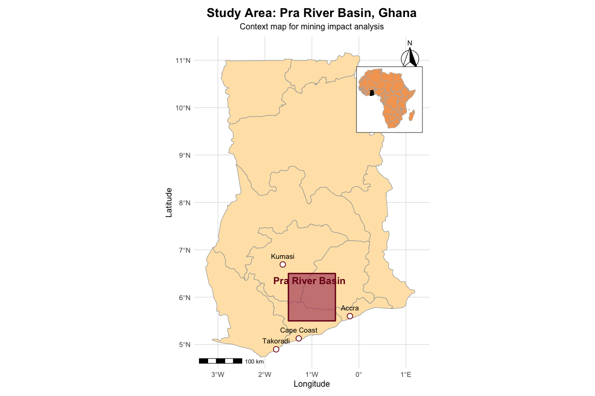
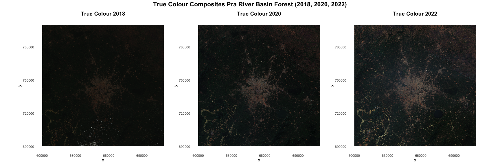
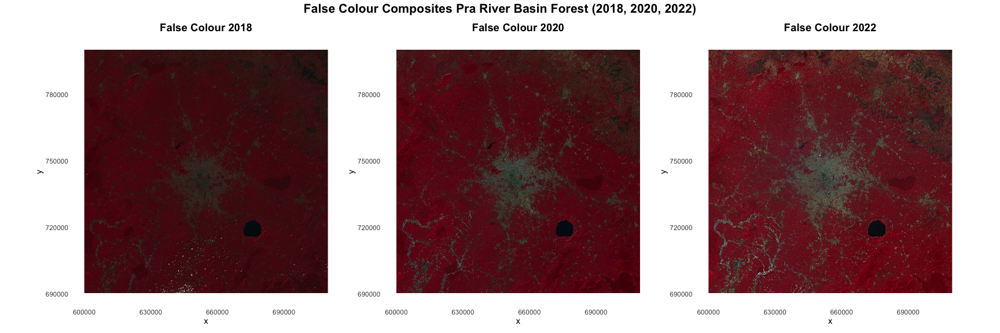
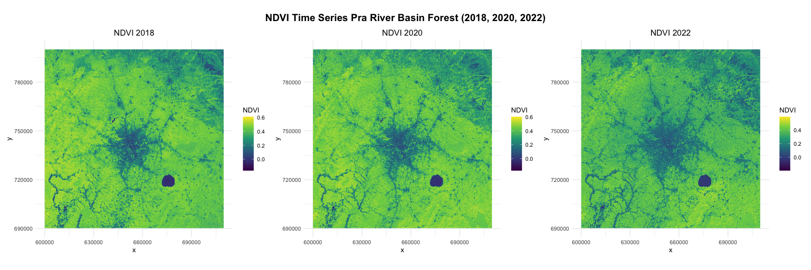
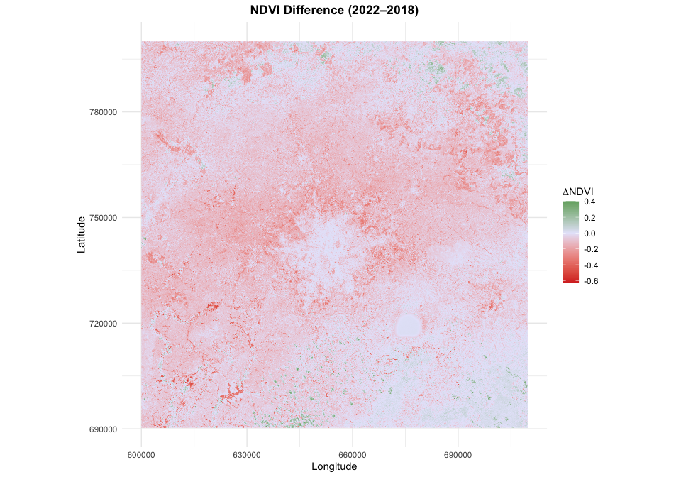
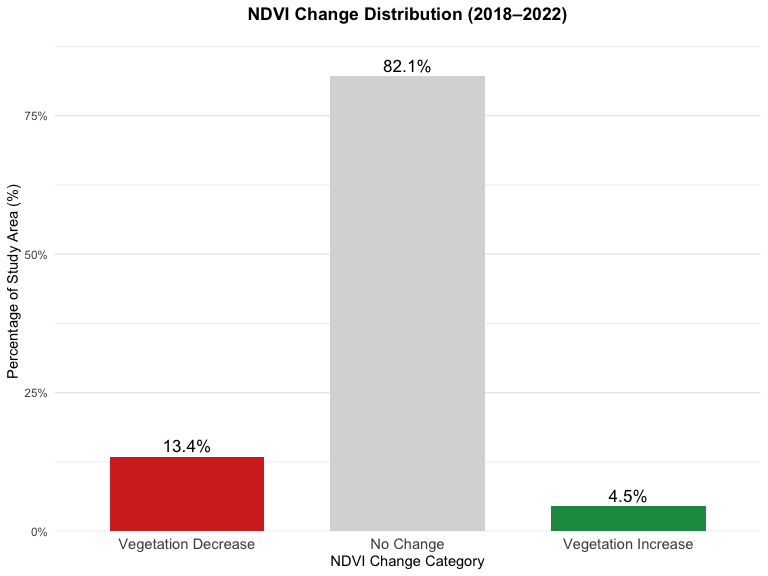
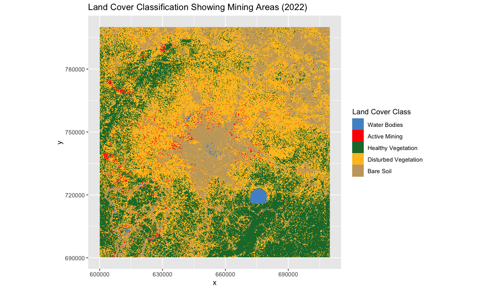
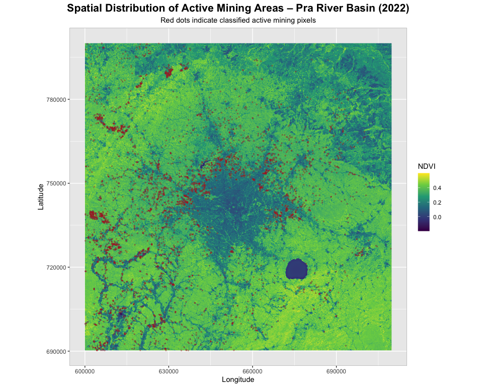
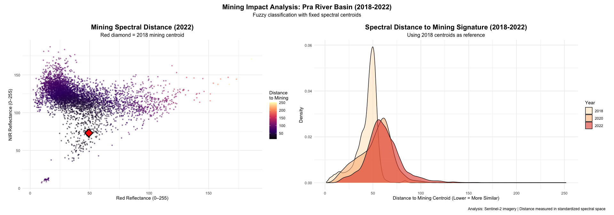
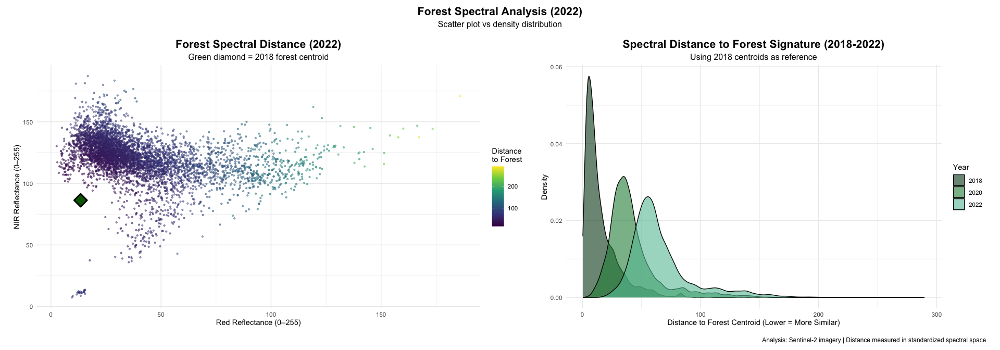

Mining-Induced Forest Degradation in Ghana’s Pra River Basin: A
Multi-Temporal Remote Sensing Analysis
================
Iris Nana Obeng
2026-03-30

``` r
library(rnaturalearth)
library(rnaturalearthdata)
library(ggspatial)
library(terra)
library(ggplot2) 
library(patchwork) 
library(scales) 
library(RStoolbox)
library(sf) 
library(dplyr)
library(viridis)
library(MASS)
library(grid)
```

## 1. Introduction

The study focuses on the Pra River Basin in southern Ghana, a region
that drains parts of the Ashanti, Eastern, and Central regions before
discharging into the Gulf of Guinea. The basin is characterized by
tropical forest ecosystems and intensive human activities, particularly
artisanal and large-scale gold mining along river channels and
floodplains. Due to its ecological importance and increasing mining
pressure, the Pra River Basin provides an ideal setting for assessing
land cover and vegetation changes using satellite-based spectral
analysis.

This study employs a multi-temporal approach combining NDVI-based
classification with spectral distance metrics to assess mining-induced
forest degradation in Ghana’s Pra River Basin. Using Sentinel-2 imagery
from 2018, 2020, and 2022, we first identify mining areas through NDVI
thresholding, then quantify forest degradation by measuring spectral
distances to reference forest signatures. This integrated framework
allows us to both locate mining activities and characterize their impact
on surrounding forest ecosystems through changes in spectral similarity
over time.

While NDVI is widely used for detecting vegetation change, it is limited
in capturing subtle spectral degradation prior to complete forest loss.
To address this limitation, this study integrates NDVI-based
classification with spectral distance analysis. This combined approach
enables detection of both land cover transitions and progressive forest
degradation, providing a more comprehensive assessment of mining
impacts.

## 2. Study Area Map

``` r
# Pra River Basin Location Map – Ghana
ghana <- ne_states(country = "Ghana", returnclass = "sf")

# Pra River Basin (approximate bounding box) 
pra_bbox <- st_bbox(
  c(xmin = -1.5, xmax = -0.5,
    ymin = 5.5, ymax = 6.5),
  crs = st_crs(4326)
)
pra_basin <- st_as_sfc(pra_bbox)

# Africa map for inset
africa <- ne_countries(scale = "medium", continent = "Africa", returnclass = "sf")

# Inset map (Africa with Ghana highlighted)
inset_map <- ggplot() +
  geom_sf(data = africa, fill = "plum1", color = "grey70", linewidth = 0.2) +
  geom_sf(data = ghana, fill = palette$study_area, color = "black", linewidth = 0.3) +
  coord_sf(xlim = c(-20, 60), ylim = c(-40, 40), expand = FALSE) +
  theme_void() +
  theme(panel.background = element_rect(fill = "white", color = "black", linewidth = 0.5))

# Main Ghana map
main_map <- ggplot() +
  geom_sf(data = ghana, fill = palette$ghana_bg, color = "grey60", linewidth = 0.3) +
  geom_sf(
    data = pra_basin,
    fill = palette$study_area,
    alpha = 0.6,
    color = palette$study_area,
    linewidth = 0.8
  ) +
  
  # Major cities
  geom_point(
    data = data.frame(
      city = c("Accra", "Kumasi", "Cape Coast", "Takoradi"),
      lon = c(-0.19, -1.62, -1.28, -1.76),
      lat = c(5.60, 6.69, 5.13, 4.90)
    ),
    aes(x = lon, y = lat),
    shape = 21, size = 3,
    fill = "white", color = "black"
  ) +
  
  geom_text(
    data = data.frame(
      city = c("Accra", "Kumasi", "Cape Coast", "Takoradi"),
      lon = c(-0.19, -1.62, -1.28, -1.76),
      lat = c(5.60, 6.69, 5.13, 4.90)
    ),
    aes(x = lon, y = lat, label = city),
    nudge_y = 0.15,
    size = 3.5
  ) +
  
  annotation_scale(location = "bl", width_hint = 0.3) +
  annotation_north_arrow(location = "tr", style = north_arrow_fancy_orienteering) +
  
  labs(
    title = "Study Area: Pra River Basin, Ghana",
    subtitle = "Context map for mining impact analysis",
    x = "Longitude",
    y = "Latitude"
  ) +
  
  annotate(
    "text",
    x = -1.0, y = 6.35,
    label = "Pra River Basin",
    size = 5,
    fontface = "bold",
    color = palette$study_area
  ) +
  
  coord_sf(xlim = c(-3.5, 1.5), ylim = c(4.5, 11.5), expand = FALSE) +
  theme_minimal() +
  theme(
    plot.title = element_text(hjust = 0.5, face = "bold", size = 18),
    plot.subtitle = element_text(hjust = 0.5, size = 12),
    panel.grid = element_line(color = "grey90"),
    axis.text = element_text(size = 9)
  )

# Combine main + inset
final_map <- main_map +
  inset_element(inset_map, left = 0.65, bottom = 0.65, right = 0.98, top = 0.98)


final_map
```

<!-- -->

``` r
ggsave("maps/pra_river_basin_ghana_location.png", final_map,
       width = 16, height = 10, dpi = 300, bg = "white")
```

## 3. Data and Preprocessing

### 3.1 Data Acquisition

Sentinel-2 imagery for the PRA River Basin was acquired from the
Copernicus Open Access Hub. The images were selected based on cloud
cover (\<10%) and seasonal consistency (dry season) to ensure accurate
vegetation analysis.

### 3.2 Image Preprocessing

All Sentinel-2 imagery was preprocessed prior to analysis. Bands were
reprojected to a common coordinate reference system (CRS), spatially
aligned, and clipped to the Pra River Basin boundary. Cloud-contaminated
pixels were excluded where necessary.

### 3.3 Sentinel-2 Bands (2018, 2020, 2022)

### 2018 Bands

``` r
blue_2018  <- rast("./S2A_MSIL2A_20180112T102401_N0500_R065_T30NXN_20230717T153523.SAFE/T30NXN_20180112T102401_B02_10m.jp2")
green_2018 <- rast("./S2A_MSIL2A_20180112T102401_N0500_R065_T30NXN_20230717T153523.SAFE/T30NXN_20180112T102401_B03_10m.jp2")
red_2018   <- rast("./S2A_MSIL2A_20180112T102401_N0500_R065_T30NXN_20230717T153523.SAFE/T30NXN_20180112T102401_B04_10m.jp2")
nir_2018   <- rast("./S2A_MSIL2A_20180112T102401_N0500_R065_T30NXN_20230717T153523.SAFE/T30NXN_20180112T102401_B08_10m.jp2")
```

### 2020 Bands

``` r
blue_2020  <- rast("./S2A_MSIL2A_20200102T102421_N0500_R065_T30NXN_20230425T023320.SAFE/T30NXN_20200102T102421_B02_10m.jp2")
green_2020 <- rast("./S2A_MSIL2A_20200102T102421_N0500_R065_T30NXN_20230425T023320.SAFE/T30NXN_20200102T102421_B03_10m.jp2")
red_2020   <- rast("./S2A_MSIL2A_20200102T102421_N0500_R065_T30NXN_20230425T023320.SAFE/T30NXN_20200102T102421_B04_10m.jp2")
nir_2020   <- rast("./S2A_MSIL2A_20200102T102421_N0500_R065_T30NXN_20230425T023320.SAFE/T30NXN_20200102T102421_B08_10m.jp2")
```

### 2022 Bands

``` r
blue_2022  <- rast("./S2B_MSIL2A_20220126T102209_N0510_R065_T30NXN_20240506T042828.SAFE/T30NXN_20220126T102209_B02_10m.jp2")
green_2022 <- rast("./S2B_MSIL2A_20220126T102209_N0510_R065_T30NXN_20240506T042828.SAFE/T30NXN_20220126T102209_B03_10m.jp2")
red_2022   <- rast("./S2B_MSIL2A_20220126T102209_N0510_R065_T30NXN_20240506T042828.SAFE/T30NXN_20220126T102209_B04_10m.jp2")
nir_2022   <- rast("./S2B_MSIL2A_20220126T102209_N0510_R065_T30NXN_20240506T042828.SAFE/T30NXN_20220126T102209_B08_10m.jp2")
```

### 3.4 Creating RGB Composites

``` r
# True Color composites (Red-Green-Blue)
tc_2018 <- c(red_2018, green_2018, blue_2018)
tc_2020 <- c(red_2020, green_2020, blue_2020)
tc_2022 <- c(red_2022, green_2022, blue_2022)

# False Color composites (NIR-Red-Green)
fc_2018 <- c(nir_2018, red_2018, green_2018)
fc_2020 <- c(nir_2020, red_2020, green_2020)
fc_2022 <- c(nir_2022, red_2022, green_2022)
```

### 3.5 Custom Visualization Functions

``` r
im.ggplotRGB <- function(img, r = 1, g = 2, b = 3,
                         stretch = TRUE, downsample = 6,
                         show_axes = TRUE, title = "True Colour") {
  
  if (nlyr(img) < 3) stop("img must be a 3-band SpatRaster.")
  
  img_small <- terra::aggregate(img, fact = downsample)
  df <- as.data.frame(img_small, xy = TRUE, na.rm = TRUE)
  names(df)[3:5] <- c("R","G","B")
  
  if (stretch) {
    df$R <- scales::rescale(df$R, to = c(0,1))
    df$G <- scales::rescale(df$G, to = c(0,1))
    df$B <- scales::rescale(df$B, to = c(0,1))
  }
  
  p <- ggplot(df, aes(x = x, y = y)) +
    geom_raster(aes(fill = rgb(R, G, B))) +
    scale_fill_identity() +
    coord_equal() +
    ggtitle(title) +
    theme_minimal() +
    theme(plot.title = element_text(hjust = 0.5, size = 14, face = "bold"),
          panel.grid = element_blank())
  
  if (!show_axes) {
    p <- p + theme(axis.title = element_blank(),
                   axis.text = element_blank(),
                   axis.ticks = element_blank())
  }
  
  return(p)
}

ndvi_change_class <- function(ndvi_diff){
  class_r <- ndvi_diff * 0
  class_r[ndvi_diff > 0.1]  <- 1  # Vegetation increase
  class_r[ndvi_diff < -0.1] <- 2  # Vegetation decrease
  return(class_r)
}

plot_singleband_gg <- function(r, downsample = 8, title = "") {
  r_small <- terra::aggregate(r, fact = downsample)
  df <- as.data.frame(r_small, xy = TRUE, na.rm = TRUE)
  names(df)[3] <- "val"
  ggplot(df, aes(x = x, y = y, fill = val)) +
    geom_raster() +
    scale_fill_viridis_c(option = "D", na.value = "transparent") +
    coord_equal() +
    ggtitle(title) +
    labs(fill = "NDVI") +
    theme_minimal() +
    theme(plot.title = element_text(hjust = 0.5))
}

# Convert raster to dataframe for plotting
prepare_raster_df <- function(raster_layer, downsample_factor = 12){
  
  raster_small <- terra::aggregate(raster_layer, fact = downsample_factor, fun = mean)
  
  df <- as.data.frame(raster_small, xy = TRUE, na.rm = TRUE)
  
  value_col <- setdiff(names(df), c("x","y"))[1]
  names(df)[names(df) == value_col] <- "value"
  
  return(df)
}
```

### 3.6 True Color (RGB) Visualization

    ## |---------|---------|---------|---------|=========================================                                          

    ## |---------|---------|---------|---------|=========================================                                          

    ## |---------|---------|---------|---------|=========================================                                          

<!-- -->

### 3.7 False Color Visualization

    ## |---------|---------|---------|---------|=========================================                                          

    ## |---------|---------|---------|---------|=========================================                                          

    ## |---------|---------|---------|---------|=========================================                                          

<!-- -->

## 4. Methods

### 4.1 NDVI Calculation

``` r
ndvi_calc <- function(nir, red) {
  nd <- (nir - red) / (nir + red)
  names(nd) <- "NDVI"
  return(nd)
}

ndvi_2018 <- ndvi_calc(nir_2018, red_2018)
```

    ## |---------|---------|---------|---------|=========================================                                          |---------|---------|---------|---------|=========================================                                          |---------|---------|---------|---------|=========================================                                          

``` r
ndvi_2020 <- ndvi_calc(nir_2020, red_2020)
```

    ## |---------|---------|---------|---------|=========================================                                          |---------|---------|---------|---------|=========================================                                          |---------|---------|---------|---------|=========================================                                          

``` r
ndvi_2022 <- ndvi_calc(nir_2022, red_2022)
```

    ## |---------|---------|---------|---------|=========================================                                          |---------|---------|---------|---------|=========================================                                          |---------|---------|---------|---------|=========================================                                          

### 4.2 NDVI-Based Land Cover Classification Function

Land cover classes were derived from NDVI values using rule-based
thresholds designed to distinguish water, mining or bare surfaces,
healthy vegetation, and disturbed vegetation. Thresholds were selected
based on typical spectral behaviour in tropical environments and refined
through visual comparison with Sentinel-2 true-colour and false-colour
composites.

Water bodies were identified as pixels with NDVI values below 0.05.
Healthy vegetation was defined as pixels with NDVI values equal to or
greater than 0.40, while disturbed vegetation included intermediate NDVI
values between 0.25 and 0.40. Bare soil was classified within the lower
positive NDVI range between 0.05 and 0.25. Mining areas were identified
using a change-based rule, in which pixels with low NDVI in 2022 and
high vegetation values in 2018 were interpreted as areas of recent
vegetation removal associated with mining activity.

``` r
im.classify <- function(ndvi_current, ndvi_previous = NULL, 
                        water_threshold = 0.05,
                        mining_threshold = 0.30,
                        healthy_threshold = 0.40,
                        disturbed_low = 0.25,
                        disturbed_high = 0.40) {
  
  # Initialize raster
  class_raster <- ndvi_current * 0
  values(class_raster) <- NA
  
  # -------------------------------
  # 1. WATER
  # -------------------------------
  water_mask <- ndvi_current < water_threshold
  class_raster[water_mask] <- 1
  cat("Water pixels:", global(water_mask, "sum", na.rm=TRUE)[1,1], "\n")
  
  # -------------------------------
  # 2. MINING
  # -------------------------------
  if(!is.null(ndvi_previous)) {
    
    mining_mask <- (
      ndvi_current < mining_threshold &
      ndvi_previous > 0.45
    ) & (!water_mask)
    
    class_raster[mining_mask] <- 2
    cat("Active mining pixels:", global(mining_mask, "sum", na.rm=TRUE)[1,1], "\n")
    
  } else {
    mining_mask <- ndvi_current * 0
    mining_mask[] <- FALSE
  }
  
  # -------------------------------
  # 3. HEALTHY VEGETATION
  # -------------------------------
  healthy_mask <- (
    ndvi_current >= healthy_threshold
  ) & (!water_mask) & (!mining_mask)
  
  class_raster[healthy_mask] <- 3
  cat("Healthy vegetation pixels:", global(healthy_mask, "sum", na.rm=TRUE)[1,1], "\n")
  
  # -------------------------------
  # 4. DISTURBED VEGETATION
  # -------------------------------
  disturbed_mask <- (
    ndvi_current >= disturbed_low &
    ndvi_current < disturbed_high
  ) & (!water_mask) & (!mining_mask) & (!healthy_mask)
  
  class_raster[disturbed_mask] <- 4
  cat("Disturbed vegetation pixels:", global(disturbed_mask, "sum", na.rm=TRUE)[1,1], "\n")
  
  # -------------------------------
  # 5. BARE SOIL
  # -------------------------------
  bare_mask <- (
    ndvi_current >= water_threshold &
    ndvi_current < disturbed_low
  ) & (!water_mask) & (!mining_mask) & (!healthy_mask) & (!disturbed_mask)
  
  class_raster[bare_mask] <- 5
  cat("Bare soil pixels:", global(bare_mask, "sum", na.rm=TRUE)[1,1], "\n")
  
  # -------------------------------
  # SUMMARY
  # -------------------------------
  unclassified <- is.na(values(class_raster))
  cat("Unclassified pixels:", sum(unclassified, na.rm = TRUE), "\n")
  
  names(class_raster) <- "classification"
  return(class_raster)
}

cat(">>> RUNNING CLASSIFICATION <<< \n")
```

    ## >>> RUNNING CLASSIFICATION <<<

``` r
vegetation_classes <- im.classify(
  ndvi_current = ndvi_2022, 
  ndvi_previous = ndvi_2018
)
```

    ## |---------|---------|---------|---------|=========================================                                          |---------|---------|---------|---------|=========================================                                          |---------|---------|---------|---------|=========================================                                          |---------|---------|---------|---------|=========================================                                          Water pixels: 1093464 
    ## |---------|---------|---------|---------|=========================================                                          |---------|---------|---------|---------|=========================================                                          |---------|---------|---------|---------|=========================================                                          |---------|---------|---------|---------|=========================================                                          |---------|---------|---------|---------|=========================================                                          |---------|---------|---------|---------|=========================================                                          Active mining pixels: 3819279 
    ## |---------|---------|---------|---------|=========================================                                          |---------|---------|---------|---------|=========================================                                          |---------|---------|---------|---------|=========================================                                          |---------|---------|---------|---------|=========================================                                          |---------|---------|---------|---------|=========================================                                          |---------|---------|---------|---------|=========================================                                          Healthy vegetation pixels: 37934451 
    ## |---------|---------|---------|---------|=========================================                                          |---------|---------|---------|---------|=========================================                                          |---------|---------|---------|---------|=========================================                                          |---------|---------|---------|---------|=========================================                                          |---------|---------|---------|---------|=========================================                                          |---------|---------|---------|---------|=========================================                                          |---------|---------|---------|---------|=========================================                                          |---------|---------|---------|---------|=========================================                                          |---------|---------|---------|---------|=========================================                                          |---------|---------|---------|---------|=========================================                                          Disturbed vegetation pixels: 51943858 
    ## |---------|---------|---------|---------|=========================================                                          |---------|---------|---------|---------|=========================================                                          |---------|---------|---------|---------|=========================================                                          |---------|---------|---------|---------|=========================================                                          |---------|---------|---------|---------|=========================================                                          |---------|---------|---------|---------|=========================================                                          |---------|---------|---------|---------|=========================================                                          |---------|---------|---------|---------|=========================================                                          |---------|---------|---------|---------|=========================================                                          |---------|---------|---------|---------|=========================================                                          |---------|---------|---------|---------|=========================================                                          |---------|---------|---------|---------|=========================================                                          Bare soil pixels: 25769348 
    ## Unclassified pixels: 0

``` r
cat(">>> CLASSIFICATION COMPLETE <<< \n")
```

    ## >>> CLASSIFICATION COMPLETE <<<

``` r
print(vegetation_classes)
```

    ## class       : SpatRaster 
    ## size        : 10980, 10980, 1  (nrow, ncol, nlyr)
    ## resolution  : 10, 10  (x, y)
    ## extent      : 6e+05, 709800, 690240, 800040  (xmin, xmax, ymin, ymax)
    ## coord. ref. : WGS 84 / UTM zone 30N (EPSG:32630) 
    ## source      : spat_bb369f1b77_47926_kn9ay1v2CLquyTW.tif 
    ## varname     : T30NXN_20220126T102209_B08_10m 
    ## name        : classification 
    ## min value   :              1 
    ## max value   :              5

Mining areas were identified using a change-based approach, where pixels
exhibiting high vegetation values in the baseline year (NDVI \> 0.45 in
2018) and low NDVI in the target year (NDVI \< 0.30 in 2022) were
classified as active mining. This approach captures recent vegetation
removal associated with mining activities rather than static bare
surfaces.

### 4.3 Spectral Distance Analysis

``` r
# Creating spectral stacks
spec_stack_2018 <- c(blue_2018, green_2018, red_2018, nir_2018)
names(spec_stack_2018) <- c("Blue", "Green", "Red", "NIR")

spec_stack_2020 <- c(blue_2020, green_2020, red_2020, nir_2020)
names(spec_stack_2020) <- c("Blue", "Green", "Red", "NIR")

spec_stack_2022 <- c(blue_2022, green_2022, red_2022, nir_2022)
names(spec_stack_2022) <- c("Blue", "Green", "Red", "NIR")

# Spatial aggregation
spec_small_2018 <- terra::aggregate(spec_stack_2018, fact = 10)
```

    ## |---------|---------|---------|---------|=========================================                                          

``` r
spec_small_2020 <- terra::aggregate(spec_stack_2020, fact = 10)
```

    ## |---------|---------|---------|---------|=========================================                                          

``` r
spec_small_2022 <- terra::aggregate(spec_stack_2022, fact = 10)
```

    ## |---------|---------|---------|---------|=========================================                                          

``` r
print(sprintf("Resolution reduced to: %.1f meters", terra::res(spec_small_2018)[1]))
```

    ## [1] "Resolution reduced to: 100.0 meters"

### 4.4 Fuzzy Classification Functions

``` r
im.fuzzy <- function(input_image, num_clusters = 3, seed = 42, m = 2, do_plot = FALSE) {
  
  if (!inherits(input_image, "SpatRaster")) stop("Input must be a SpatRaster object")
  
  vals <- terra::as.matrix(input_image)
  valid_idx <- complete.cases(vals)
  vals <- vals[valid_idx, , drop = FALSE]
  
  if (nrow(vals) == 0) stop("No valid pixels found")
  
  # Standardize to 0-255 scale
  for (i in 1:ncol(vals)) {
    min_val <- min(vals[, i], na.rm = TRUE)
    max_val <- max(vals[, i], na.rm = TRUE)
    if (max_val > min_val) {
      vals[, i] <- 255 * (vals[, i] - min_val) / (max_val - min_val)
    } else {
      vals[, i] <- 0
    }
  }
  
  # K-means clustering
  set.seed(seed)
  km_result <- kmeans(vals, centers = num_clusters)
  centers <- km_result$centers
  
  # Calculate distances
  dist_matrix <- matrix(NA, nrow(vals), num_clusters)
  for (k in 1:num_clusters) {
    diff_matrix <- sweep(vals, 2, centers[k, ], "-")
    dist_matrix[, k] <- sqrt(rowSums(diff_matrix^2))
  }
  
  # Fuzzy membership
  exponent <- 2 / (m - 1)
  membership_matrix <- matrix(NA, nrow(vals), num_clusters)
  
  for (i in 1:nrow(dist_matrix)) {
    distances <- dist_matrix[i, ]
    
    if (any(distances == 0)) {
      membership <- rep(0, num_clusters)
      exact_matches <- which(distances == 0)
      membership[exact_matches] <- 1 / length(exact_matches)
    } else {
      ratio_matrix <- outer(distances, distances, "/")
      membership <- 1 / rowSums(ratio_matrix^exponent)
    }
    membership_matrix[i, ] <- membership
  }
  
  # Create output rasters
  template_raster <- input_image[[1]]
  distance_rasters <- list()
  membership_rasters <- list()
  
  for (k in 1:num_clusters) {
    dist_raster <- template_raster
    dist_values <- rep(NA, terra::ncell(template_raster))
    dist_values[valid_idx] <- dist_matrix[, k]
    terra::values(dist_raster) <- dist_values
    distance_rasters[[k]] <- dist_raster
    
    mem_raster <- template_raster
    mem_values <- rep(NA, terra::ncell(template_raster))
    mem_values[valid_idx] <- membership_matrix[, k]
    terra::values(mem_raster) <- mem_values
    membership_rasters[[k]] <- mem_raster
  }
  
  distance_stack <- terra::rast(distance_rasters)
  names(distance_stack) <- paste0("class_", 1:num_clusters, "_distance")
  
  membership_stack <- terra::rast(membership_rasters)
  names(membership_stack) <- paste0("class_", 1:num_clusters, "_membership")
  
  return(list(
    distances = distance_stack,
    memberships = membership_stack,
    centers = centers,
    raw_distances = dist_matrix,
    scaled_values = vals
  ))
}

# Fixed-centroid version for temporal analysis
im.fuzzy.fixed <- function(input_image, fixed_centers, m = 2, do_plot = FALSE) {
  
  vals <- terra::as.matrix(input_image)
  valid_idx <- complete.cases(vals)
  vals <- vals[valid_idx, , drop = FALSE]
  
  if (nrow(vals) == 0) stop("No valid pixels found")
  
  # Standardize
  for (i in 1:ncol(vals)) {
    min_val <- min(vals[, i], na.rm = TRUE)
    max_val <- max(vals[, i], na.rm = TRUE)
    if (max_val > min_val) {
      vals[, i] <- 255 * (vals[, i] - min_val) / (max_val - min_val)
    } else {
      vals[, i] <- 0
    }
  }
  
  centers <- fixed_centers
  num_clusters <- nrow(centers)
  
  # Calculate distances to fixed centroids
  dist_matrix <- matrix(NA, nrow(vals), num_clusters)
  for (k in 1:num_clusters) {
    diff_matrix <- sweep(vals, 2, centers[k, ], "-")
    dist_matrix[, k] <- sqrt(rowSums(diff_matrix^2))
  }
  
  # Fuzzy membership calculation
  exponent <- 2 / (m - 1)
  membership_matrix <- matrix(NA, nrow(vals), num_clusters)
  
  for (i in 1:nrow(dist_matrix)) {
    distances <- dist_matrix[i, ]
    
    if (any(distances == 0)) {
      membership <- rep(0, num_clusters)
      exact_matches <- which(distances == 0)
      membership[exact_matches] <- 1 / length(exact_matches)
    } else {
      ratio_matrix <- outer(distances, distances, "/")
      membership <- 1 / rowSums(ratio_matrix^exponent)
    }
    
    membership_matrix[i, ] <- membership
  }
  
  # Create output rasters
  template_raster <- input_image[[1]]
  
  distance_rasters <- list()
  membership_rasters <- list()
  
  for (k in 1:num_clusters) {
    # Distance raster
    dist_raster <- template_raster
    dist_values <- rep(NA, terra::ncell(template_raster))
    dist_values[valid_idx] <- dist_matrix[, k]
    terra::values(dist_raster) <- dist_values
    distance_rasters[[k]] <- dist_raster
    
    # Membership raster
    mem_raster <- template_raster
    mem_values <- rep(NA, terra::ncell(template_raster))
    mem_values[valid_idx] <- membership_matrix[, k]
    terra::values(mem_raster) <- mem_values
    membership_rasters[[k]] <- mem_raster
  }
  
  # Compile outputs
  distance_stack <- terra::rast(distance_rasters)
  names(distance_stack) <- paste0("class_", 1:num_clusters, "_distance")
  
  membership_stack <- terra::rast(membership_rasters)
  names(membership_stack) <- paste0("class_", 1:num_clusters, "_membership")
  
  if (do_plot) {
    terra::plot(membership_stack, 
                main = "Fuzzy Membership Maps (Fixed Centroids)",
                col = viridis::viridis(100))
  }
  
  return(list(
    distances = distance_stack,
    memberships = membership_stack,
    centers = centers,
    raw_distances = dist_matrix,
    scaled_values = vals
  ))
}

print("Fuzzy classification")
```

    ## [1] "Fuzzy classification"

### 4.5 Distance Extraction Function

``` r
# Function to extract and sample distances
extract_distances <- function(fuzzy_result, year_label, class_idx, n_samples) {
  dists <- fuzzy_result$raw_distances[, class_idx]
  
  if (length(dists) > n_samples) {
    set.seed(42)
    dists <- sample(dists, n_samples)
  }
  
  data.frame(
    Year = year_label,
    Distance = dists
  )
}
```

### 4.6 Fuzzy Classification Implementation

``` r
# 2018 centroids (baseline)
print("Step 1: Computing 2018 baseline centroids...")
```

    ## [1] "Step 1: Computing 2018 baseline centroids..."

``` r
fuzzy_2018 <- im.fuzzy(spec_small_2018, num_clusters = 3, seed = 42, do_plot = FALSE)
centroids_2018 <- fuzzy_2018$centers

# Saving centroids for reproducibility
write.csv(centroids_2018, "centroids_2018.csv", row.names = FALSE)
print("2018 centroids saved to 'centroids_2018.csv'")
```

    ## [1] "2018 centroids saved to 'centroids_2018.csv'"

``` r
# Applying same centroids to 2020 and 2022 
print("Step 2: Applying 2018 centroids to 2020 and 2022...")
```

    ## [1] "Step 2: Applying 2018 centroids to 2020 and 2022..."

``` r
fuzzy_2020 <- im.fuzzy.fixed(spec_small_2020, fixed_centers = centroids_2018, do_plot = FALSE)
fuzzy_2022 <- im.fuzzy.fixed(spec_small_2022, fixed_centers = centroids_2018, do_plot = FALSE)

print("Temporal analysis complete for all three years")
```

    ## [1] "Temporal analysis complete for all three years"

### 4.7 Mining Class Identification

``` r
# Identify mining class based on spectral signature
red_nir_ratio <- centroids_2018[, 3] / centroids_2018[, 4]

# Create centroid_analysis for forest identification
centroid_analysis <- data.frame(
  Class = 1:3,
  Red = centroids_2018[, 3],
  NIR = centroids_2018[, 4]
)

centroid_analysis$NDVI <- (centroid_analysis$NIR - centroid_analysis$Red) /
                          (centroid_analysis$NIR + centroid_analysis$Red)

# Identify mining class (class with highest Red/NIR ratio)
mining_class <- which.max(red_nir_ratio)

# Identify forest class (class with highest NDVI)
forest_class <- which.max(centroid_analysis$NDVI)

# Create centroid_df for display
centroid_df <- data.frame(
  Class = 1:3,
  Blue = round(centroids_2018[, 1], 1),
  Green = round(centroids_2018[, 2], 1),
  Red = round(centroids_2018[, 3], 1),
  NIR = round(centroids_2018[, 4], 1),
  Red_NIR_Ratio = round(red_nir_ratio, 3),
  Interpretation = "Undetermined"
)

# Assign interpretations consistently
for (i in 1:3) {
  if (i == mining_class) {
    centroid_df$Interpretation[i] <- "Mining/Bare Soil"
  } else if (i == forest_class) {
    centroid_df$Interpretation[i] <- "Healthy Vegetation"
  } else {
    centroid_df$Interpretation[i] <- "Disturbed Vegetation"
  }
}

print("Spectral Characteristics of Each Class:")
```

    ## [1] "Spectral Characteristics of Each Class:"

``` r
print(centroid_df)
```

    ##   Class Blue Green  Red  NIR Red_NIR_Ratio       Interpretation
    ## 1     1 30.1  39.8 49.2 73.0         0.674     Mining/Bare Soil
    ## 2     2 14.9  20.5 22.2 66.0         0.337 Disturbed Vegetation
    ## 3     3 11.5  17.1 13.5 86.3         0.156   Healthy Vegetation

``` r
print(paste("Mining class is Class", mining_class))
```

    ## [1] "Mining class is Class 1"

``` r
print(paste("Forest class is Class", forest_class))
```

    ## [1] "Forest class is Class 3"

| Class | Blue | Green |  Red |  NIR | Red_NIR_Ratio | Interpretation       |
|------:|-----:|------:|-----:|-----:|--------------:|:---------------------|
|     1 | 30.1 |  39.8 | 49.2 | 73.0 |         0.674 | Mining/Bare Soil     |
|     2 | 14.9 |  20.5 | 22.2 | 66.0 |         0.337 | Disturbed Vegetation |
|     3 | 11.5 |  17.1 | 13.5 | 86.3 |         0.156 | Healthy Vegetation   |

## 5. Results

### 5.1 NDVI Time Series Analysis

    ## |---------|---------|---------|---------|=========================================                                          

    ## |---------|---------|---------|---------|=========================================                                          

    ## |---------|---------|---------|---------|=========================================                                          

<!-- -->

### 5.2 NDVI Change Detection

    ## |---------|---------|---------|---------|=========================================                                          

    ## |---------|---------|---------|---------|=========================================                                          |---------|---------|---------|---------|=========================================                                          |---------|---------|---------|---------|=========================================                                          |---------|---------|---------|---------|=========================================                                          |---------|---------|---------|---------|=========================================                                          

    ## |---------|---------|---------|---------|=========================================                                          

    ## |---------|---------|---------|---------|=========================================                                          

<!-- -->

### 5.2.1 NDVI Change Distribution (Bar Chart)

``` r
ndvi_change_clean <- df_change[!is.na(df_change$class), ]
class_counts <- table(ndvi_change_clean$class)
class_names <- names(class_counts)

ndvi_change_summary <- data.frame(
  class = factor(
    class_names,
    levels = c("Vegetation Decrease", "No Change", "Vegetation Increase")
  ),
  pixel_count = as.numeric(class_counts),
  percentage = as.numeric(class_counts) / sum(class_counts) * 100
)

ndvi_change_bar <- ggplot(
  ndvi_change_summary,
  aes(x = class, y = percentage, fill = class)
) +
  geom_col(width = 0.7) +
  geom_text(
    aes(label = paste0(round(percentage, 1), "%")),
    vjust = -0.4,
    size = 4.5
  ) +
  scale_fill_manual(
    values = c(
      "Vegetation Decrease" = "#D73027",
      "No Change" = "#D9D9D9",
      "Vegetation Increase" = "#1A9850"
    ),
    guide = "none"
  ) +
  scale_y_continuous(
    labels = percent_format(scale = 1),
    expand = expansion(mult = c(0, 0.1))
  ) +
  labs(
    x = "NDVI Change Category",
    y = "Percentage of Study Area (%)",
    title = "NDVI Change Distribution (2018–2022)"
  ) +
  theme_minimal() +
  theme(
    plot.title = element_text(hjust = 0.5, face = "bold"),
    axis.text.x = element_text(size = 11),
    panel.grid.major.x = element_blank()
  )

ndvi_change_bar
```

<!-- -->

``` r
ggsave(
  "maps/ndvi_change_percentage_bar_chart.png",
  ndvi_change_bar,
  width = 8,
  height = 6,
  dpi = 300
)
```

### 5.3 Land Cover Classification Map

#### 5.3.1 Vegetation Classification Map

``` r
class_small <- terra::aggregate(vegetation_classes, fact = 8, fun = modal, na.rm = TRUE)

df_class <- as.data.frame(class_small, xy = TRUE)
df_class <- na.omit(df_class)
colnames(df_class) <- c("x", "y", "class")

class_colors <- c(
  "1" = palette$water_bodies,     # Dodger blue - Water
  "2" = palette$mining,           # Coral red - Active Mining
  "3" = palette$healthy_forest,   # Forest green - Healthy Vegetation
  "4" = palette$disturbed_forest, # Sandy brown - Disturbed Vegetation
  "5" = palette$bare_soil         # Tan - Bare Soil
)

im_class_map <- ggplot(df_class, aes(x = x, y = y, fill = factor(class))) +
  geom_raster() +
  scale_fill_manual(
    values = class_colors,
    name = "Land Cover Class",
    labels = c(
      "1" = "Water Bodies",
      "2" = "Active Mining",
      "3" = "Healthy Vegetation",
      "4" = "Disturbed Vegetation",
      "5" = "Bare Soil"
    )
  ) +
  coord_equal() +
  labs(title = "Land Cover Classification Showing Mining Areas (2022)") +
  theme_minimal()

im_class_map
```

<!-- -->

``` r
ggsave("maps/vegetation_mining_2022.png", im_class_map,
       width = 10, height = 6, dpi = 300, bg = "white")
```

### 5.4 Mining Distribution and Influence

#### 5.4.1 Mining Distribution Map

    ## |---------|---------|---------|---------|=========================================                                          

<!-- -->

### 5.5 Spectral Analysis of Mining Areas

``` r
 # Create distance data for mining class
dist_data <- rbind(
  extract_distances(fuzzy_2018, "2018", mining_class, 5000),
  extract_distances(fuzzy_2020, "2020", mining_class, 5000),
  extract_distances(fuzzy_2022, "2022", mining_class, 5000)
)

# Density plot
p_density <- ggplot(dist_data, aes(x = Distance, fill = Year)) +
  geom_density(alpha = 0.6) +
  scale_fill_manual(values = c("2018" = "#FEE8C8", "2020" = "#FDBB84", "2022" = "#E34A33")) +
  labs(
    title = "Spectral Distance to Mining Signature (2018-2022)",
    subtitle = "Using 2018 centroids as reference",
    x = "Distance to Mining Centroid (Lower = More Similar)",
    y = "Density"
  ) +
  theme_minimal() +
  theme(
    plot.title = element_text(hjust = 0.5, face = "bold", size = 14),
    plot.subtitle = element_text(hjust = 0.5, size = 11)
  )

# Mining spectral scatter (2022)
df_mining_scatter <- data.frame(
  Red      = fuzzy_2022$scaled_values[, 3],
  NIR      = fuzzy_2022$scaled_values[, 4],
  Distance = fuzzy_2022$raw_distances[, mining_class]
)

set.seed(42)
if (nrow(df_mining_scatter) > 5000) {
  df_mining_scatter <- df_mining_scatter[sample(nrow(df_mining_scatter), 5000), ]
}

p_mining_scatter <- ggplot(df_mining_scatter,
                           aes(x = Red, y = NIR, color = Distance)) +
  geom_point(alpha = 0.5, size = 0.8) +
  scale_color_viridis_c(
    option = "magma",
    name = "Distance\nto Mining"
  ) +
  geom_point(
    data = data.frame(
      x = fuzzy_2018$centers[mining_class, 3],
      y = fuzzy_2018$centers[mining_class, 4]
    ),
    aes(x = x, y = y),
    shape = 23, size = 6,
    fill = "red", color = "black", stroke = 1.5
  ) +
  labs(
    title = "Mining Spectral Distance (2022)",
    subtitle = "Red diamond = 2018 mining centroid",
    x = "Red Reflectance (0–255)",
    y = "NIR Reflectance (0–255)"
  ) +
  theme_minimal()

combined <- (p_mining_scatter | p_density) +
  plot_layout(widths = c(1.3, 1.1), heights = c(1)) +
  plot_annotation(
    title = "Mining Impact Analysis: Pra River Basin (2018-2022)",
    subtitle = "Fuzzy classification with fixed spectral centroids",
    caption = "Analysis: Sentinel-2 imagery | Distance measured in standardized spectral space"
  ) &
  theme(
    plot.title = element_text(hjust = 0.5, size = 16, face = "bold"),
    plot.subtitle = element_text(hjust = 0.5, size = 12),
    plot.caption = element_text(size = 9),
    plot.margin = margin(10, 10, 10, 10),
    panel.spacing = unit(1.2, "lines")
  )

print(combined)
```

<!-- -->

``` r
ggsave(
  "maps/mining_spectral_analysis.png", combined, width = 20,
  height = 7, dpi = 300, bg = "white")
```

### 5.6 Forest Spectral Analysis

``` r
# Forest spectral scatter (2022)

centroid_analysis$NDVI <- (centroid_analysis$NIR - centroid_analysis$Red) /
                          (centroid_analysis$NIR + centroid_analysis$Red)


df_forest_scatter <- data.frame(
  Red      = fuzzy_2022$scaled_values[, 3],
  NIR      = fuzzy_2022$scaled_values[, 4],
  Distance = fuzzy_2022$raw_distances[, forest_class]
)

set.seed(42)
if (nrow(df_forest_scatter) > 5000) {
  df_forest_scatter <- df_forest_scatter[
    sample(nrow(df_forest_scatter), 5000), ]
}

p_forest_scatter <- ggplot(df_forest_scatter,
                           aes(x = Red, y = NIR, color = Distance)) +
  geom_point(alpha = 0.5, size = 0.8) +
  scale_color_viridis_c(
    option = "viridis",
    name = "Distance \nto Forest"
  ) +
  geom_point(
    data = data.frame(
      x = fuzzy_2018$centers[forest_class, 3],
      y = fuzzy_2018$centers[forest_class, 4]
    ),
    aes(x = x, y = y),
    shape = 23, size = 6,
    fill = "darkgreen", color = "black", stroke = 1.5
  ) +
  labs(
    title = "Forest Spectral Distance (2022)",
    subtitle = "Green diamond = 2018 forest centroid",
    x = "Red Reflectance (0–255)",
    y = "NIR Reflectance (0–255)"
  ) +
  theme_minimal()

# Forest distance density plot
dist_data <- rbind(
  extract_distances(fuzzy_2018, "2018", forest_class, 5000),
  extract_distances(fuzzy_2020, "2020", forest_class, 5000),
  extract_distances(fuzzy_2022, "2022", forest_class, 5000)
)  

p_forest_density <- ggplot(dist_data, aes(x = Distance, fill = Year)) +
  geom_density(alpha = 0.6) +
  scale_fill_manual(values = c(
    "2018" = "#00441B",
    "2020" = "#238B45",  
    "2022" = "#66C2A4"
  )) +
  labs(
    title = "Spectral Distance to Forest Signature (2018-2022)",  
    subtitle = "Using 2018 centroids as reference",
    x = "Distance to Forest Centroid (Lower = More Similar)",  
    y = "Density"
  ) +
  theme_minimal() +
  theme(
    plot.title = element_text(hjust = 0.5, face = "bold", size = 14),
    plot.subtitle = element_text(hjust = 0.5, size = 11)
  )


combined_forest <- (p_forest_scatter | p_forest_density) +
  plot_layout(widths = c(1.3, 1.1), heights = c(1)) + 
  plot_annotation(
    title = "Forest Spectral Analysis (2022)",
    subtitle = "Scatter plot vs density distribution",
    caption = "Analysis: Sentinel-2 imagery | Distance measured in standardized spectral space"
  ) &
  theme(
    plot.title = element_text(hjust = 0.5, size = 16, face = "bold"),
    plot.subtitle = element_text(hjust = 0.5, size = 12),
    plot.caption = element_text(size = 9),
    plot.margin = margin(10, 10, 10, 10),
    panel.spacing = unit(1.2, "lines"),
    legend.position = "right"
  )

print(combined_forest)
```

<!-- -->

``` r
ggsave(
  "maps/forest_spectral_analysis.png", combined_forest,  
  width = 20, height = 8, dpi = 300, bg = "white")
```

## 6. Discussion

The integrated NDVI and spectral distance analysis reveals important
patterns in mining-induced forest degradation within the Pra River
Basin:

### 6.1 Spectral Evidence of Degradation

The fuzzy classification analysis shows that the landscape is becoming
increasingly different from reference forest signatures established in
2018. The density plots for forest spectral distance demonstrate a
progressive shift toward higher distances over time, indicating:

- 2018-2020: Initial degradation signals

- 2020-2022: Accelerated forest spectral change

This increase in spectral distance from the 2018 forest centroid
indicates a gradual loss of forest structural integrity. Such changes
likely reflect canopy thinning, increased soil exposure, and reduced
chlorophyll content, all of which are characteristic of forest
degradation rather than complete land cover conversion.

### 6.2 Methodological Insights

Combining NDVI thresholding (for mining identification) with spectral
distance metrics (for degradation assessment) provides complementary
information:

NDVI effectively separates vegetated from non-vegetated surfaces

Spectral distances capture subtle changes in forest condition before
complete clearance.

### 6.3 Limitations

This study is subject to several limitations. NDVI is sensitive to
environmental factors such as soil moisture and atmospheric conditions,
which may influence vegetation estimates. Additionally, the
classification approach may confuse bare soil with mining areas in some
cases. The absence of ground-truth validation data also limits the
ability to quantitatively assess classification accuracy. Despite these
limitations, the integration of NDVI and spectral distance analysis
provides a robust framework for detecting relative patterns of forest
degradation.

## 7. Conclusion

This multi-temporal assessment demonstrates significant mining-induced
forest degradation in the Pra River Basin between 2018 and 2022. Key
findings include:

- Spatial extent: Mining activities are concentrated along river
  corridors, with spectral influence extending into surrounding forest
  areas

- Temporal trend: Progressive loss of forest spectral integrity, with
  acceleration in the 2020-2022 period

- Methodological contribution: The integrated approach of NDVI
  classification and spectral distance metrics provides a robust
  framework for monitoring mining impacts using freely available
  Sentinel-2 data

The methods employed offer a reproducible approach for assessing
mining-induced forest degradation in tropical regions, supporting
evidence-based environmental management and policy decisions.
