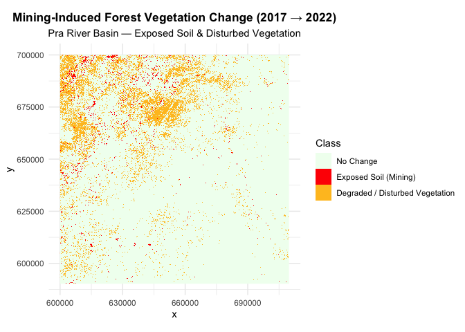

Assessing Mining-Induced Forest Vegetation Change in the PRA River Basin
Using Sentinel-2 Imagery
================
Iris Nana Obeng
2025-12-15

## Introduction

The PRA River Basin, located in Ghana, has experienced significant
environmental changes due to mining activities. This study aims to
assess the impact of mining on forest vegetation using Sentinel-2
satellite imagery from 2018, 2020, and 2022. By analyzing temporal
changes in vegetation indices, we can quantify the extent of
deforestation and degradation caused by mining operations.

## Data Acquisition

Sentinel-2 imagery for the PRA River Basin was acquired from the
Copernicus Open Access Hub. The images were selected based on cloud
cover (\<10%) and seasonal consistency (dry season) to ensure accurate
vegetation analysis.

``` r
library(terra)
library(ggplot2) 
library(patchwork) 
library(scales) 
library(RStoolbox)
library(sf) 
library(dplyr)
library(viridis)
```

``` r
if (!dir.exists("maps")) {
  dir.create("maps")
}
```

## Custom Visualization Functions

``` r
im.ggplotRGB <- function(img, r = 1, g = 2, b = 3,
                         stretch = TRUE, downsample = 6,
                         show_axes = TRUE, title = "True Colour") {
  
  if (nlyr(img) < 3) stop("img must be a 3-band SpatRaster.")
  
  img_small <- terra::aggregate(img, fact = downsample)
  df <- as.data.frame(img_small, xy = TRUE, na.rm = TRUE)
  names(df)[3:5] <- c("R","G","B")
  
  if (stretch) {
    df$R <- scales::rescale(df$R, to = c(0,1))
    df$G <- scales::rescale(df$G, to = c(0,1))
    df$B <- scales::rescale(df$B, to = c(0,1))
  }
  
  p <- ggplot(df, aes(x = x, y = y)) +
    geom_raster(aes(fill = rgb(R, G, B))) +
    scale_fill_identity() +
    coord_equal() +
    ggtitle(title) +
    theme_minimal() +
    theme(plot.title = element_text(hjust = 0.5, size = 14, face = "bold"),
          panel.grid = element_blank())
  
  if (!show_axes) {
    p <- p + theme(axis.title = element_blank(),
                   axis.text = element_blank(),
                   axis.ticks = element_blank())
  }
  
  return(p)
}


ndvi_change_class <- function(ndvi_diff){
class_r <- ndvi_diff * 0
class_r[ndvi_diff > 0.1]  <- 1  # Vegetation increase
class_r[ndvi_diff < -0.1] <- 2  # Vegetation decrease
return(class_r)
}

plot_singleband_gg <- function(r, downsample = 8, title = "") {
  r_small <- terra::aggregate(r, fact = downsample)
  df <- as.data.frame(r_small, xy = TRUE, na.rm = TRUE)
  names(df)[3] <- "val"
  ggplot(df, aes(x = x, y = y, fill = val)) +
    geom_raster() +
    scale_fill_viridis_c(option = "D", na.value = "transparent") +
    coord_equal() +
    ggtitle(title) +
    labs(fill = "NDVI") +
    theme_minimal() +
    theme(plot.title = element_text(hjust = 0.5))
}
```

## Load Sentinel-2 images for 2018, 2020, and 2022

### 2018 Bands

``` r
blue_2018  <- rast("./S2A_MSIL2A_20180112T102401_N0500_R065_T30NXN_20230717T153523.SAFE/T30NXN_20180112T102401_B02_10m.jp2")
green_2018 <- rast("./S2A_MSIL2A_20180112T102401_N0500_R065_T30NXN_20230717T153523.SAFE/T30NXN_20180112T102401_B03_10m.jp2")
  red_2018   <- rast("./S2A_MSIL2A_20180112T102401_N0500_R065_T30NXN_20230717T153523.SAFE/T30NXN_20180112T102401_B04_10m.jp2")
  nir_2018   <- rast("./S2A_MSIL2A_20180112T102401_N0500_R065_T30NXN_20230717T153523.SAFE/T30NXN_20180112T102401_B08_10m.jp2")
```

### 2020 Bands

``` r
blue_2020  <- rast("./S2A_MSIL2A_20200102T102421_N0500_R065_T30NXN_20230425T023320.SAFE/T30NXN_20200102T102421_B02_10m.jp2")
green_2020 <- rast("./S2A_MSIL2A_20200102T102421_N0500_R065_T30NXN_20230425T023320.SAFE/T30NXN_20200102T102421_B03_10m.jp2")
red_2020   <- rast("./S2A_MSIL2A_20200102T102421_N0500_R065_T30NXN_20230425T023320.SAFE/T30NXN_20200102T102421_B04_10m.jp2")
nir_2020   <- rast("./S2A_MSIL2A_20200102T102421_N0500_R065_T30NXN_20230425T023320.SAFE/T30NXN_20200102T102421_B08_10m.jp2")
```

### 2022 Bands

``` r
blue_2022  <- rast("./S2B_MSIL2A_20220126T102209_N0510_R065_T30NXN_20240506T042828.SAFE/T30NXN_20220126T102209_B02_10m.jp2")
green_2022 <- rast("./S2B_MSIL2A_20220126T102209_N0510_R065_T30NXN_20240506T042828.SAFE/T30NXN_20220126T102209_B03_10m.jp2")
red_2022   <- rast("./S2B_MSIL2A_20220126T102209_N0510_R065_T30NXN_20240506T042828.SAFE/T30NXN_20220126T102209_B04_10m.jp2")
nir_2022   <- rast("./S2B_MSIL2A_20220126T102209_N0510_R065_T30NXN_20240506T042828.SAFE/T30NXN_20220126T102209_B08_10m.jp2")
```

## 5. Creating RGB Composites and Visualizing

- True Color (RGB): Red, Green, Blue bands - shows natural color
  representation
- False Color (NIR-R-G): NIR, Red, Green bands - highlights vegetation
  health False color is particularly useful for vegetation studies as
  healthy plants strongly reflect NIR.

``` r
# True Color composites (Red-Green-Blue)
tc_2018 <- c(red_2018, green_2018, blue_2018)
tc_2020 <- c(red_2020, green_2020, blue_2020)
tc_2022 <- c(red_2022, green_2022, blue_2022)

# False Color composites (NIR-Red-Green)
fc_2018 <- c(nir_2018, red_2018, green_2018)
fc_2020 <- c(nir_2020, red_2020, green_2020)
fc_2022 <- c(nir_2022, red_2022, green_2022)
```

## 6. True Color Visualization

True color images show the landscape as it appears to the human eye.
This helps identify visible changes like deforestation and bare soil
exposure.

``` r
  p_tc_2018 <- im.ggplotRGB(tc_2018, title = "True Colour 2018")
```

    ## |---------|---------|---------|---------|=========================================                                          

``` r
  p_tc_2020 <- im.ggplotRGB(tc_2020, title = "True Colour 2020")
```

    ## |---------|---------|---------|---------|=========================================                                          

``` r
  p_tc_2022 <- im.ggplotRGB(tc_2022, title = "True Colour 2022")
```

    ## |---------|---------|---------|---------|=========================================                                          

``` r
combined_true_color <- (p_tc_2018 | p_tc_2020 | p_tc_2022) +
  plot_annotation(
    title = "True Colour Composites PRA Basin Forest (2018, 2020, 2022)",
    theme = theme(
      plot.title = element_text(hjust = 0.5, size = 16, face = "bold")
    )
  ) &
  theme(
    plot.margin = margin(5, 5, 5, 5)
  )

combined_true_color
```

<!-- -->

``` r
ggsave("maps/true_color_comparison.png", combined_true_color, width = 18, height = 6, dpi = 300, bg = "white")
```

## 7. False Color Visualization

False color images use near-infrared (NIR) band instead of blue. Healthy
vegetation appears bright red, water appears dark, and urban areas
appear cyan. This is excellent for monitoring vegetation health and
detecting stress.

``` r
  p_fc_2018 <- im.ggplotRGB(fc_2018, title = "False Colour 2018")
```

    ## |---------|---------|---------|---------|=========================================                                          

``` r
  p_fc_2020 <- im.ggplotRGB(fc_2020, title = "False Colour 2020")
```

    ## |---------|---------|---------|---------|=========================================                                          

``` r
  p_fc_2022 <- im.ggplotRGB(fc_2022, title = "False Colour 2022")
```

    ## |---------|---------|---------|---------|=========================================                                          

``` r
combined_false_color <- (p_fc_2018 | p_fc_2020 | p_fc_2022) +
  plot_annotation(
    title = "False Colour Composites PRA Basin Forest (2018, 2020, 2022)",
    theme = theme(
      plot.title = element_text(hjust = 0.5, size = 16, face = "bold")
    )
  ) &
  theme(
    plot.margin = margin(5, 5, 5, 5)
  )

combined_false_color
```

<!-- -->

``` r
ggsave("maps/false_color_comparison.png", combined_false_color, width = 18, height = 6, dpi = 300, bg = "white")
```

## 8. NDVI Calculation and Analysis

NDVI (Normalized Difference Vegetation Index) = (NIR - Red) / (NIR +
Red) This index quantifies vegetation greenness and health: - Values
range from -1 to +1 - High values (\>0.5) indicate dense, healthy
vegetation - Low values (\<0.2) indicate bare soil or water - Negative
values typically indicate water

``` r
  ndvi_calc <- function(nir, red) {
    nd <- (nir - red) / (nir + red)
    names(nd) <- "NDVI"
    return(nd)
  }
  ndvi_2018 <- ndvi_calc(nir_2018, red_2018)
```

    ## |---------|---------|---------|---------|=========================================                                          |---------|---------|---------|---------|=========================================                                          |---------|---------|---------|---------|=========================================                                          

``` r
  ndvi_2020 <- ndvi_calc(nir_2020, red_2020)
```

    ## |---------|---------|---------|---------|=========================================                                          |---------|---------|---------|---------|=========================================                                          |---------|---------|---------|---------|=========================================                                          

``` r
  ndvi_2022 <- ndvi_calc(nir_2022, red_2022)
```

    ## |---------|---------|---------|---------|=========================================                                          |---------|---------|---------|---------|=========================================                                          |---------|---------|---------|---------|=========================================                                          

## 9. NDVI Time Series Visualization

Visualizing NDVI to help identify areas of vegetation loss or
degradation over time.

``` r
p_ndvi_2018 <- plot_singleband_gg(ndvi_2018, title = "NDVI 2018")
```

    ## |---------|---------|---------|---------|=========================================                                          

``` r
p_ndvi_2020 <- plot_singleband_gg(ndvi_2020, title = "NDVI 2020")
```

    ## |---------|---------|---------|---------|=========================================                                          

``` r
p_ndvi_2022 <- plot_singleband_gg(ndvi_2022, title = "NDVI 2022")
```

    ## |---------|---------|---------|---------|=========================================                                          

``` r
combined_ndvi <- (p_ndvi_2018 | p_ndvi_2020 | p_ndvi_2022) +
  plot_annotation(
    title = "NDVI Time Series PRA Basin Forest (2018, 2020, 2022)",
    theme = theme(
      plot.title = element_text(
        hjust = 0.5,
        size = 16,
        face = "bold"
      )
    )
  ) &
  theme(
    plot.margin = margin(5, 5, 5, 5),
    legend.position = "right"
  )

combined_ndvi
```

<!-- -->

``` r
ggsave("maps/ndvi_timeseries.png", combined_ndvi, 
       width = 18, height = 8, dpi = 300, bg = "white")
```

## 10. NDVI Change Detection

Detecting significant changes in NDVI between 2018 and 2022 to identify
areas of vegetation loss or gain.

``` r
  ndvi_diff_18_22 <- ndvi_2022 - ndvi_2018
```

    ## |---------|---------|---------|---------|=========================================                                          

``` r
  ndvi_change_18_22_class <- ndvi_change_class(ndvi_diff_18_22)
```

    ## |---------|---------|---------|---------|=========================================                                          |---------|---------|---------|---------|=========================================                                          |---------|---------|---------|---------|=========================================                                          |---------|---------|---------|---------|=========================================                                          |---------|---------|---------|---------|=========================================                                          

``` r
  ndvi_change_discrete <- terra::aggregate(ndvi_change_18_22_class, fact = 8)
```

    ## |---------|---------|---------|---------|=========================================                                          

``` r
  df_change <- as.data.frame(ndvi_change_discrete, xy = TRUE, na.rm = TRUE)
  colnames(df_change) <- c("x", "y", "class")
  
  df_change$class <- factor(df_change$class, 
                           levels = c(0, 1, 2),
                           labels = c("No Change", "Vegetation Increase", "Vegetation Decrease"))

  p_ndvi_diff_18_22 <- plot_singleband_gg(ndvi_diff_18_22, 
                                          title = "NDVI Difference (2022-2018)") +
    scale_fill_gradient2(low = "red2", mid = "beige", high = "darkgreen", 
                        midpoint = 0, name = "ΔNDVI")
```

    ## |---------|---------|---------|---------|=========================================                                          

``` r
  p_ndvi_change_18_22_class <- ggplot(df_change, aes(x = x, y = y, fill = class)) +
    geom_raster() +
    scale_fill_manual(
      values = c("No Change" = "beige", 
                "Vegetation Increase" = "darkgreen", 
                "Vegetation Decrease" = "red2"),
      name = "NDVI Change",
      na.value = "white"
    ) +
    coord_equal() +
    ggtitle("NDVI Change Classes (2018-2022)") +
    theme_minimal() +
    theme(plot.title = element_text(hjust = 0.5))

  combined_ndvi_change <- (p_ndvi_diff_18_22 | p_ndvi_change_18_22_class) +
  plot_annotation(
    title = "NDVI Change Detection PRA Basin Forest (2018–2022)",
    theme = theme(
      plot.title = element_text(hjust = 0.5, size = 16, face = "bold")
    )
  ) &
  theme(
    plot.margin = margin(5, 5, 5, 5)
  )

combined_ndvi_change
```

<!-- -->

``` r
  ggsave("maps/ndvi_change_detection_2018_2022.png", combined_ndvi_change, 
         width = 20, height = 7, dpi = 300)
```

## 11. NDVI CHANGE BAR CHART ((Percentage of Study Area)

``` r
# Summarising NDVI change classes as percentages
ndvi_change_summary <- df_change %>%
  filter(!is.na(class)) %>%  
  group_by(class) %>%
  summarise(pixel_count = n()) %>%
  mutate(percentage = pixel_count / sum(pixel_count) * 100)

# Bar chart
ndvi_change_bar <- ggplot(ndvi_change_summary,
                          aes(x = class, y = percentage, fill = class)) +
  geom_col(width = 0.6) +
  geom_text(
    aes(label = paste0(round(percentage, 1), "%")),
    vjust = -0.3,
    size = 4
  ) +
  scale_fill_manual(
    values = c(
      "Vegetation Decrease" = "#FF000047",
      "No Change" = "#F5F5DC",
      "Vegetation Increase" = "#7ACD32"
    ),
    guide = "none"
  ) +
  scale_y_continuous(
    labels = percent_format(scale = 1),
    limits = c(0, NA)
  ) +
  labs(
    x = "NDVI Change Category",
    y = "Percentage of Study Area (%)",
    title = "NDVI Change Distribution (2018–2022)"
  ) +
  theme_minimal() +
  theme(
    plot.title = element_text(hjust = 0.5, face = "bold"),
    axis.text.x = element_text(size = 11)
  )

ndvi_change_bar
```

<!-- -->

``` r
ggsave("maps/ndvi_change_percentage_bar_chart.png",ndvi_change_bar,width = 8,height = 6,dpi = 300)
```

## 12. Vegetation Classification & Mining Hotspots

Classify NDVI values into vegetation health categories to identify
mining-impacted areas.

``` r
### 1. DEFINING CLASSES

# Healthy vegetation
healthy_veg <- ndvi_2022 >= 0.45
```

    ## |---------|---------|---------|---------|=========================================                                          

``` r
# Disturbed vegetation (decline but not bare)
disturbed_veg <- (ndvi_2022 >= 0.25) & (ndvi_2022 < 0.45)
```

    ## |---------|---------|---------|---------|=========================================                                          |---------|---------|---------|---------|=========================================                                          |---------|---------|---------|---------|=========================================                                          

``` r
# Bare ground / non-forest
bare_soil <- (ndvi_2022 >= 0) & (ndvi_2022 < 0.25)
```

    ## |---------|---------|---------|---------|=========================================                                          |---------|---------|---------|---------|=========================================                                          |---------|---------|---------|---------|=========================================                                          

``` r
# Water mask
water <- ndvi_2022 < 0  
```

    ## |---------|---------|---------|---------|=========================================                                          

``` r
# Active mining (big NDVI drop from healthy → bare)
active_mining <- (ndvi_2018 >= 0.45) & (ndvi_2022 < 0.25)
```

    ## |---------|---------|---------|---------|=========================================                                          |---------|---------|---------|---------|=========================================                                          |---------|---------|---------|---------|=========================================                                          

``` r
### 2. CREATING CLASS RASTER
 
class_raster <- ndvi_2022 * 0
```

    ## |---------|---------|---------|---------|=========================================                                          

``` r
values(class_raster) <- NA  
```

    ## |---------|---------|---------|---------|=========================================                                          

``` r
class_raster[healthy_veg] <- 1
```

    ## |---------|---------|---------|---------|=========================================                                          

``` r
class_raster[disturbed_veg] <- 2       
```

    ## |---------|---------|---------|---------|=========================================                                          

``` r
class_raster[bare_soil] <- 3          
```

    ## |---------|---------|---------|---------|=========================================                                          

``` r
class_raster[water] <- 4                
```

    ## |---------|---------|---------|---------|=========================================                                          

``` r
class_raster[active_mining] <- 5     
```

    ## |---------|---------|---------|---------|=========================================                                          

``` r
class_small <- aggregate(class_raster, fact=10, fun=modal, na.rm=TRUE)

### 3. CONVERTING TO DATAFRAME

df_class <- as.data.frame(class_small, xy=TRUE)
df_class <- na.omit(df_class)
colnames(df_class) <- c("x", "y", "class")

### 4. DEFINING COLORS + LABELS

class_colors <- c(
  "1" = "forestgreen",    # Healthy Vegetation
  "2" = "goldenrod1",     # Disturbed Vegetation
  "3" = "peru",           # Bare Ground / Non-Forest
  "4" = "deepskyblue",    # Water
  "5" = "red"             # Active Mining Areas
)

class_labels <- c(
  "Healthy Vegetation",
  "Disturbed Vegetation",
  "Bare Ground / Non-Forest",
  "Water",
  "Active Mining Areas"
)


### 5. PLOTTING VEGETATION CHANGE MAP

change_map <- ggplot(df_class) +
  geom_raster(aes(x=x, y=y, fill=factor(class))) +
  scale_fill_manual(values=class_colors, labels=class_labels, name="Vegetation Change class") +
  coord_equal() +
  labs(
    title="Forest Vegetation Change Map (2018 → 2022)",
    subtitle="Classification of vegetation health, bare ground exposure, and mining hotspots"
  ) +
  theme(
    plot.title=element_text(hjust=0.5, size=15, face="bold"),
    plot.subtitle=element_text(hjust=0.5, size=11),
    axis.text=element_text(size=9),
    panel.grid=element_blank()
  )

change_map
```

<!-- -->

``` r
ggsave("maps/vegetation_change_classification.png", change_map, width = 10, height = 6, dpi = 300)
```

### 13. EMPHASIZING MINING HOTSPOTS

``` r
mining_df <- df_class
mining_df$value <- ifelse(mining_df$class == 5, 1, 0)
mining_df$value <- factor(mining_df$value, 
                          levels = c(0, 1),
                          labels = c("Non-Mining Areas", "Active Mining Areas"))

# Extracting mining points only for the overlay
mining_pts <- mining_df[mining_df$value == "Active Mining Areas", ]

# Thin points for better visualization 
set.seed(123)
sample_size <- max(1, floor(0.05 * nrow(mining_pts)))  # Take 5% or at least 1 point
mining_pts_thin <- mining_pts[sample(nrow(mining_pts), size = sample_size), ]

# Mining map with emphasis
mining_map <- ggplot(mining_df) +
  geom_raster(aes(x = x, y = y, fill = value)) +
  geom_point(
    data = mining_pts_thin,
    aes(x = x, y = y),
    shape = 21,          
    size = 1.5,
    fill = "red",
    color = "black",
    stroke = 0.25,
    alpha = 0.8
  ) +
  scale_fill_manual(
    values = c("Non-Mining Areas" = "khaki1", "Active Mining Areas" = "red"),
    name = "Mining Status"
  ) +
  coord_equal() +
  labs(
    title = "Active Mining Hotspots (2018 → 2022)",
    subtitle = "NDVI-based detection with hotspot emphasis"
  ) +
  theme(
    plot.title = element_text(hjust = 0.5, size = 14, face = "bold"),
    plot.subtitle = element_text(hjust = 0.5),
    panel.grid = element_blank()
  )

mining_map
```

<!-- -->

``` r
ggsave("maps/mining_hotspots_emphasized.png", mining_map, width = 10, height = 6, dpi = 300)
```

## Summary

This analysis demonstrates significant vegetation changes in the PRA
River Basin between 2018 and 2022, with mining activities identified as
a primary driver of deforestation. The methods employed provide a
reproducible framework for monitoring mining impacts on forest
ecosystems using freely available Sentinel-2 data.
