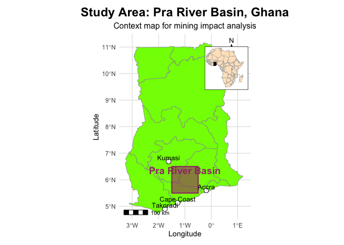
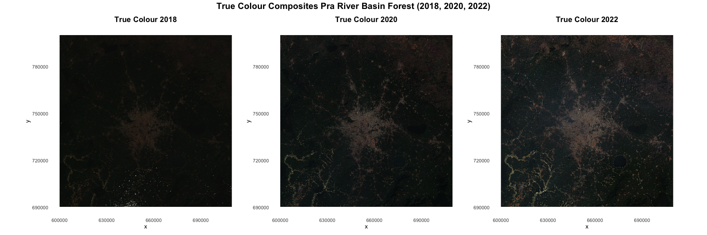
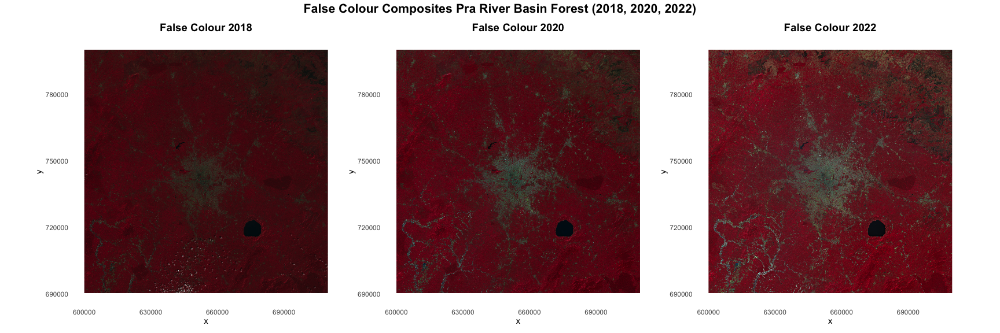
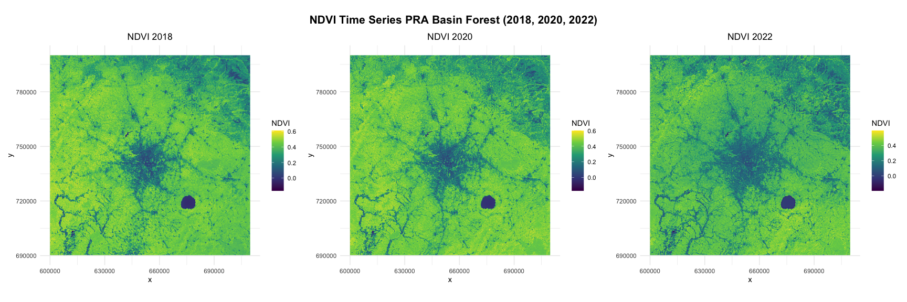
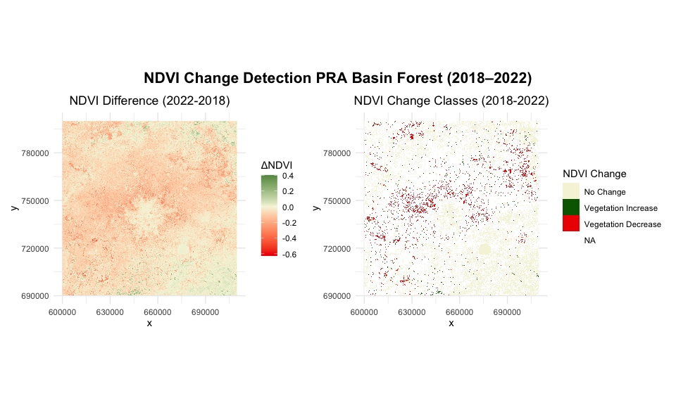
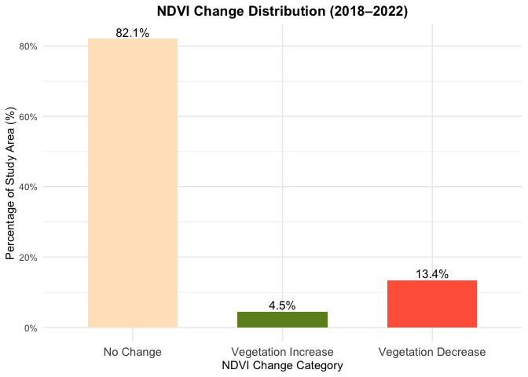
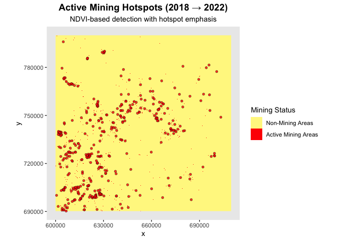
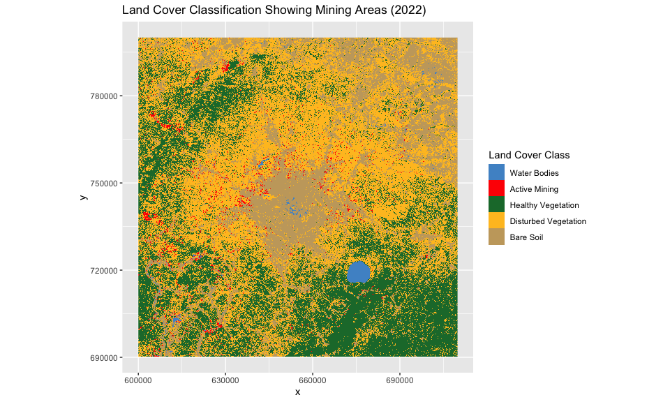
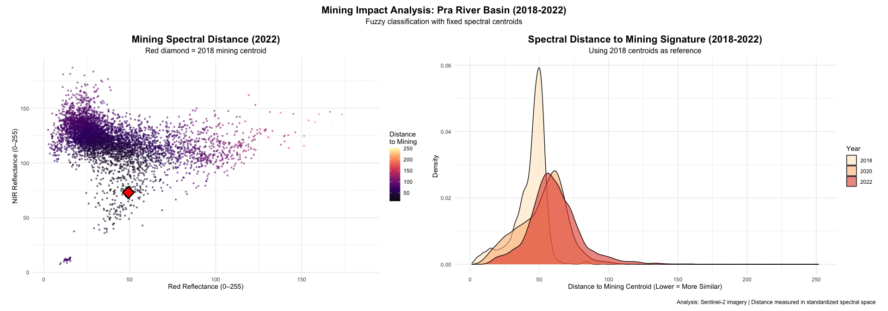
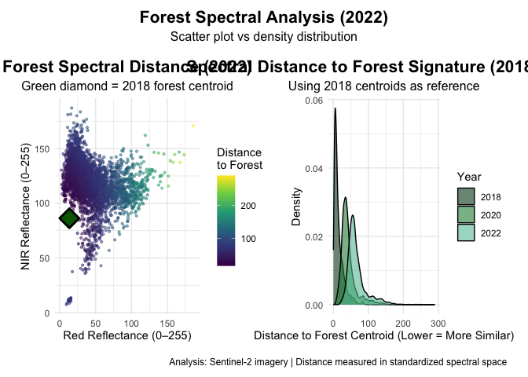

Assessing Mining-Induced Forest Vegetation Change in the PRA River Basin
Using Sentinel-2 Imagery
================
Iris Nana Obeng
2025-12-15

## Introduction

The study focuses on the Pra River Basin in southern Ghana, a region
that drains parts of the Ashanti, Eastern, and Central regions before
discharging into the Gulf of Guinea. The basin is characterized by
tropical forest ecosystems and intensive human activities, particularly
artisanal and large-scale gold mining along river channels and
floodplains. Due to its ecological importance and increasing mining
pressure, the Pra River Basin provides an ideal setting for assessing
land cover and vegetation changes using satellite-based spectral
analysis.

The PRA River Basin, located in Ghana, has experienced significant
environmental changes due to mining activities. This study aims to
assess the impact of mining on forest vegetation using Sentinel-2
satellite imagery from 2018, 2020, and 2022. By analyzing temporal
changes in vegetation indices, we can quantify the extent of
deforestation and degradation caused by mining operations.

## Data Acquisition

Sentinel-2 imagery for the PRA River Basin was acquired from the
Copernicus Open Access Hub. The images were selected based on cloud
cover (\<10%) and seasonal consistency (dry season) to ensure accurate
vegetation analysis.

``` r
if (!dir.exists("maps")) {
  dir.create("maps")
}
```

``` r
library(rnaturalearth)
library(rnaturalearthdata)
library(ggspatial)
library(terra)
library(ggplot2) 
library(patchwork) 
library(scales) 
library(RStoolbox)
library(sf) 
library(dplyr)
library(viridis)
```

``` r
# Pra River Basin Location Map – Ghana

ghana <- ne_states(country = "Ghana", returnclass = "sf")

# Pra River Basin (approximate bounding box) 
# Latitude: 5.5–6.5 N | Longitude: -1.5 – -0.5 W
pra_bbox <- st_bbox(
  c(xmin = -1.5, xmax = -0.5,
    ymin = 5.5, ymax = 6.5),
  crs = st_crs(4326)
)

pra_basin <- st_as_sfc(pra_bbox)

# ---- 5. Africa map for inset ----
africa <- ne_countries(
  scale = "medium",
  continent = "Africa",
  returnclass = "sf"
)

# ---- 6. Insetting map (Africa with Ghana highlighted) ----
inset_map <- ggplot() +
  geom_sf(data = africa, fill = "bisque", color = "grey70", linewidth = 0.2) +
  geom_sf(data = ghana, fill = "#2E86AB", color = "black", linewidth = 0.3) +
  coord_sf(xlim = c(-20, 60), ylim = c(-40, 40), expand = FALSE) +
  theme_void() +
  theme(
    panel.background = element_rect(fill = "white", color = "black", linewidth = 0.5)
  )

# ---- 7. Main Ghana map ----
main_map <- ggplot() +
  geom_sf(data = ghana, fill = "chartreuse", color = "grey60", linewidth = 0.3) +
  geom_sf(
    data = pra_basin,
    fill = "#A23B72",
    alpha = 0.6,
    color = "#A23B72",
    linewidth = 0.8
  ) +

  # Major cities
  geom_point(
    data = data.frame(
      city = c("Accra", "Kumasi", "Cape Coast", "Takoradi"),
      lon = c(-0.19, -1.62, -1.28, -1.76),
      lat = c(5.60, 6.69, 5.13, 4.90)
    ),
    aes(x = lon, y = lat),
    shape = 21, size = 3,
    fill = "white", color = "black"
  ) +

  geom_text(
    data = data.frame(
      city = c("Accra", "Kumasi", "Cape Coast", "Takoradi"),
      lon = c(-0.19, -1.62, -1.28, -1.76),
      lat = c(5.60, 6.69, 5.13, 4.90)
    ),
    aes(x = lon, y = lat, label = city),
    nudge_y = 0.15,
    size = 3.5
  ) +

  annotation_scale(location = "bl", width_hint = 0.3) +
  annotation_north_arrow(
    location = "tr",
    style = north_arrow_fancy_orienteering
  ) +

  labs(
    title = "Study Area: Pra River Basin, Ghana",
    subtitle = "Context map for mining impact analysis",
    x = "Longitude",
    y = "Latitude"
  ) +

  annotate(
    "text",
    x = -1.0, y = 6.35,
    label = "Pra River Basin",
    size = 5,
    fontface = "bold",
    color = "#A23B72"
  ) +

  coord_sf(xlim = c(-3.5, 1.5), ylim = c(4.5, 11.5), expand = FALSE) +
  theme_minimal() +
  theme(
    plot.title = element_text(hjust = 0.5, face = "bold", size = 18),
    plot.subtitle = element_text(hjust = 0.5, size = 12),
    panel.grid = element_line(color = "grey90"),
    axis.text = element_text(size = 9)
  )

# ---- 8. Combine main + inset ----
final_map <- main_map +
  inset_element(
    inset_map,
    left = 0.65, bottom = 0.65,
    right = 0.98, top = 0.98
  )

# ---- 9. Save map ----
dir.create("maps", showWarnings = FALSE)

ggsave(
  "maps/pra_river_basin_ghana_location.png",
  final_map,
  width = 14, height = 10, dpi = 300, bg = "white"
)

# ---- 10. Display ----
final_map
```

<!-- -->

## Custom Visualization Functions

``` r
im.ggplotRGB <- function(img, r = 1, g = 2, b = 3,
                         stretch = TRUE, downsample = 6,
                         show_axes = TRUE, title = "True Colour") {
  
  if (nlyr(img) < 3) stop("img must be a 3-band SpatRaster.")
  
  img_small <- terra::aggregate(img, fact = downsample)
  df <- as.data.frame(img_small, xy = TRUE, na.rm = TRUE)
  names(df)[3:5] <- c("R","G","B")
  
  if (stretch) {
    df$R <- scales::rescale(df$R, to = c(0,1))
    df$G <- scales::rescale(df$G, to = c(0,1))
    df$B <- scales::rescale(df$B, to = c(0,1))
  }
  
  p <- ggplot(df, aes(x = x, y = y)) +
    geom_raster(aes(fill = rgb(R, G, B))) +
    scale_fill_identity() +
    coord_equal() +
    ggtitle(title) +
    theme_minimal() +
    theme(plot.title = element_text(hjust = 0.5, size = 14, face = "bold"),
          panel.grid = element_blank())
  
  if (!show_axes) {
    p <- p + theme(axis.title = element_blank(),
                   axis.text = element_blank(),
                   axis.ticks = element_blank())
  }
  
  return(p)
}


ndvi_change_class <- function(ndvi_diff){
class_r <- ndvi_diff * 0
class_r[ndvi_diff > 0.1]  <- 1  # Vegetation increase
class_r[ndvi_diff < -0.1] <- 2  # Vegetation decrease
return(class_r)
}

plot_singleband_gg <- function(r, downsample = 8, title = "") {
  r_small <- terra::aggregate(r, fact = downsample)
  df <- as.data.frame(r_small, xy = TRUE, na.rm = TRUE)
  names(df)[3] <- "val"
  ggplot(df, aes(x = x, y = y, fill = val)) +
    geom_raster() +
    scale_fill_viridis_c(option = "D", na.value = "transparent") +
    coord_equal() +
    ggtitle(title) +
    labs(fill = "NDVI") +
    theme_minimal() +
    theme(plot.title = element_text(hjust = 0.5))
}
```

## Load Sentinel-2 images for 2018, 2020, and 2022

### 2018 Bands

``` r
blue_2018  <- rast("./S2A_MSIL2A_20180112T102401_N0500_R065_T30NXN_20230717T153523.SAFE/T30NXN_20180112T102401_B02_10m.jp2")
green_2018 <- rast("./S2A_MSIL2A_20180112T102401_N0500_R065_T30NXN_20230717T153523.SAFE/T30NXN_20180112T102401_B03_10m.jp2")
  red_2018   <- rast("./S2A_MSIL2A_20180112T102401_N0500_R065_T30NXN_20230717T153523.SAFE/T30NXN_20180112T102401_B04_10m.jp2")
  nir_2018   <- rast("./S2A_MSIL2A_20180112T102401_N0500_R065_T30NXN_20230717T153523.SAFE/T30NXN_20180112T102401_B08_10m.jp2")
```

### 2020 Bands

``` r
blue_2020  <- rast("./S2A_MSIL2A_20200102T102421_N0500_R065_T30NXN_20230425T023320.SAFE/T30NXN_20200102T102421_B02_10m.jp2")
green_2020 <- rast("./S2A_MSIL2A_20200102T102421_N0500_R065_T30NXN_20230425T023320.SAFE/T30NXN_20200102T102421_B03_10m.jp2")
red_2020   <- rast("./S2A_MSIL2A_20200102T102421_N0500_R065_T30NXN_20230425T023320.SAFE/T30NXN_20200102T102421_B04_10m.jp2")
nir_2020   <- rast("./S2A_MSIL2A_20200102T102421_N0500_R065_T30NXN_20230425T023320.SAFE/T30NXN_20200102T102421_B08_10m.jp2")
```

### 2022 Bands

``` r
blue_2022  <- rast("./S2B_MSIL2A_20220126T102209_N0510_R065_T30NXN_20240506T042828.SAFE/T30NXN_20220126T102209_B02_10m.jp2")
green_2022 <- rast("./S2B_MSIL2A_20220126T102209_N0510_R065_T30NXN_20240506T042828.SAFE/T30NXN_20220126T102209_B03_10m.jp2")
red_2022   <- rast("./S2B_MSIL2A_20220126T102209_N0510_R065_T30NXN_20240506T042828.SAFE/T30NXN_20220126T102209_B04_10m.jp2")
nir_2022   <- rast("./S2B_MSIL2A_20220126T102209_N0510_R065_T30NXN_20240506T042828.SAFE/T30NXN_20220126T102209_B08_10m.jp2")
```

## 5. Creating RGB Composites and Visualizing

- True Color (RGB): Red, Green, Blue bands - shows natural color
  representation
- False Color (NIR-R-G): NIR, Red, Green bands - highlights vegetation
  health False color is particularly useful for vegetation studies as
  healthy plants strongly reflect NIR.

``` r
# True Color composites (Red-Green-Blue)
tc_2018 <- c(red_2018, green_2018, blue_2018)
tc_2020 <- c(red_2020, green_2020, blue_2020)
tc_2022 <- c(red_2022, green_2022, blue_2022)

# False Color composites (NIR-Red-Green)
fc_2018 <- c(nir_2018, red_2018, green_2018)
fc_2020 <- c(nir_2020, red_2020, green_2020)
fc_2022 <- c(nir_2022, red_2022, green_2022)
```

## 6. True Color Visualization

True color images show the landscape as it appears to the human eye.
This helps identify visible changes like deforestation and bare soil
exposure.

    ## |---------|---------|---------|---------|=========================================                                          

    ## |---------|---------|---------|---------|=========================================                                          

    ## |---------|---------|---------|---------|=========================================                                          

<!-- -->

## 7. False Color Visualization

False color images use near-infrared (NIR) band instead of blue. Healthy
vegetation appears bright red, water appears dark, and urban areas
appear cyan. This is excellent for monitoring vegetation health and
detecting stress.

    ## |---------|---------|---------|---------|=========================================                                          

    ## |---------|---------|---------|---------|=========================================                                          

    ## |---------|---------|---------|---------|=========================================                                          

<!-- -->

## 8. NDVI Calculation and Analysis

NDVI (Normalized Difference Vegetation Index) = (NIR - Red) / (NIR +
Red) This index quantifies vegetation greenness and health: - Values
range from -1 to +1 - High values (\>0.5) indicate dense, healthy
vegetation - Low values (\<0.2) indicate bare soil or water - Negative
values typically indicate water

``` r
  ndvi_calc <- function(nir, red) {
    nd <- (nir - red) / (nir + red)
    names(nd) <- "NDVI"
    return(nd)
  }
  ndvi_2018 <- ndvi_calc(nir_2018, red_2018)
```

    ## |---------|---------|---------|---------|=========================================                                          |---------|---------|---------|---------|=========================================                                          |---------|---------|---------|---------|=========================================                                          

``` r
  ndvi_2020 <- ndvi_calc(nir_2020, red_2020)
```

    ## |---------|---------|---------|---------|=========================================                                          |---------|---------|---------|---------|=========================================                                          |---------|---------|---------|---------|=========================================                                          

``` r
  ndvi_2022 <- ndvi_calc(nir_2022, red_2022)
```

    ## |---------|---------|---------|---------|=========================================                                          |---------|---------|---------|---------|=========================================                                          |---------|---------|---------|---------|=========================================                                          

## 9. NDVI Time Series Visualization

Visualizing NDVI to help identify areas of vegetation loss or
degradation over time.

    ## |---------|---------|---------|---------|=========================================                                          

    ## |---------|---------|---------|---------|=========================================                                          

    ## |---------|---------|---------|---------|=========================================                                          

<!-- -->

## 10. NDVI Change Detection

Detecting significant changes in NDVI between 2018 and 2022 to identify
areas of vegetation loss or gain.

    ## |---------|---------|---------|---------|=========================================                                          

    ## |---------|---------|---------|---------|=========================================                                          |---------|---------|---------|---------|=========================================                                          |---------|---------|---------|---------|=========================================                                          |---------|---------|---------|---------|=========================================                                          |---------|---------|---------|---------|=========================================                                          

    ## |---------|---------|---------|---------|=========================================                                          

    ## |---------|---------|---------|---------|=========================================                                          

<!-- -->

## 11. NDVI CHANGE BAR CHART ((Percentage of Study Area)

``` r
# Summarising NDVI change classes as percentages
ndvi_change_summary <- df_change %>%
  filter(!is.na(class)) %>%  
  group_by(class) %>%
  summarise(pixel_count = n()) %>%
  mutate(percentage = pixel_count / sum(pixel_count) * 100)

# Bar chart
ndvi_change_bar <- ggplot(ndvi_change_summary,
                          aes(x = class, y = percentage, fill = class)) +
  geom_col(width = 0.6) +
  geom_text(
    aes(label = paste0(round(percentage, 1), "%")),
    vjust = -0.3,
    size = 4
  ) +
  scale_fill_manual(
    values = c(
      "Vegetation Decrease" = "tomato",
      "No Change" = "bisque",
      "Vegetation Increase" = "olivedrab"
    ),
    guide = "none"
  ) +
  scale_y_continuous(
    labels = percent_format(scale = 1),
    limits = c(0, NA)
  ) +
  labs(
    x = "NDVI Change Category",
    y = "Percentage of Study Area (%)",
    title = "NDVI Change Distribution (2018–2022)"
  ) +
  theme_minimal() +
  theme(
    plot.title = element_text(hjust = 0.5, face = "bold"),
    axis.text.x = element_text(size = 11)
  )

ndvi_change_bar
```

<!-- -->

``` r
ggsave("maps/ndvi_change_percentage_bar_chart.png",ndvi_change_bar,width = 8,height = 6,dpi = 300)
```

## 12. Vegetation Classification & Mining Hotspots

Classify NDVI values into vegetation health categories to identify
mining-impacted areas.

``` r
### 1. DEFINING CLASSES

# Healthy vegetation
healthy_veg <- ndvi_2022 >= 0.45
```

    ## |---------|---------|---------|---------|=========================================                                          

``` r
# Disturbed vegetation (decline but not bare)
disturbed_veg <- (ndvi_2022 >= 0.25) & (ndvi_2022 < 0.45)
```

    ## |---------|---------|---------|---------|=========================================                                          |---------|---------|---------|---------|=========================================                                          |---------|---------|---------|---------|=========================================                                          

``` r
# Bare ground / non-forest
bare_soil <- (ndvi_2022 >= 0) & (ndvi_2022 < 0.25)
```

    ## |---------|---------|---------|---------|=========================================                                          |---------|---------|---------|---------|=========================================                                          |---------|---------|---------|---------|=========================================                                          

``` r
# Water mask
water <- ndvi_2022 < 0  
```

    ## |---------|---------|---------|---------|=========================================                                          

``` r
# Active mining (big NDVI drop from healthy → bare)
active_mining <- (ndvi_2018 >= 0.45) & (ndvi_2022 < 0.25)
```

    ## |---------|---------|---------|---------|=========================================                                          |---------|---------|---------|---------|=========================================                                          |---------|---------|---------|---------|=========================================                                          

``` r
### 2. CREATING CLASS RASTER
 
class_raster <- ndvi_2022 * 0
```

    ## |---------|---------|---------|---------|=========================================                                          

``` r
values(class_raster) <- NA  
```

    ## |---------|---------|---------|---------|=========================================                                          

``` r
class_raster[healthy_veg] <- 1
```

    ## |---------|---------|---------|---------|=========================================                                          

``` r
class_raster[disturbed_veg] <- 2       
```

    ## |---------|---------|---------|---------|=========================================                                          

``` r
class_raster[bare_soil] <- 3          
```

    ## |---------|---------|---------|---------|=========================================                                          

``` r
class_raster[water] <- 4                
```

    ## |---------|---------|---------|---------|=========================================                                          

``` r
class_raster[active_mining] <- 5     
```

    ## |---------|---------|---------|---------|=========================================                                          

``` r
class_small <- aggregate(class_raster, fact=10, fun=modal, na.rm=TRUE)

### 3. CONVERTING TO DATAFRAME

df_class <- as.data.frame(class_small, xy=TRUE)
df_class <- na.omit(df_class)
colnames(df_class) <- c("x", "y", "class")

### 4. DEFINING COLORS + LABELS

class_colors <- c(
  "1" = "forestgreen",    # Healthy Vegetation
  "2" = "goldenrod1",     # Disturbed Vegetation
  "3" = "peru",           # Bare Ground / Non-Forest
  "4" = "deepskyblue",    # Water
  "5" = "red"             # Active Mining Areas
)

class_labels <- c(
  "Healthy Vegetation",
  "Disturbed Vegetation",
  "Bare Ground / Non-Forest",
  "Water",
  "Active Mining Areas"
)


### 5. PLOTTING VEGETATION CHANGE MAP

change_map <- ggplot(df_class) +
  geom_raster(aes(x=x, y=y, fill=factor(class))) +
  scale_fill_manual(values=class_colors, labels=class_labels, name="Vegetation Change class") +
  coord_equal() +
  labs(
    title="Forest Vegetation Change Map (2018 → 2022)",
    subtitle="Classification of vegetation health, bare ground exposure, and mining hotspots"
  ) +
  theme(
    plot.title=element_text(hjust=0.5, size=15, face="bold"),
    plot.subtitle=element_text(hjust=0.5, size=11),
    axis.text=element_text(size=9),
    panel.grid=element_blank()
  )

change_map
```

<!-- -->

``` r
ggsave("maps/vegetation_change_classification.png", change_map, width = 10, height = 6, dpi = 300)
```

### 13. EMPHASIZING MINING HOTSPOTS

``` r
mining_df <- df_class
mining_df$value <- ifelse(mining_df$class == 5, 1, 0)
mining_df$value <- factor(mining_df$value, 
                          levels = c(0, 1),
                          labels = c("Non-Mining Areas", "Active Mining Areas"))

# Extracting mining points only for the overlay
mining_pts <- mining_df[mining_df$value == "Active Mining Areas", ]

# Thin points for better visualization 
set.seed(123)
sample_size <- max(1, floor(0.05 * nrow(mining_pts)))  # Take 5% or at least 1 point
mining_pts_thin <- mining_pts[sample(nrow(mining_pts), size = sample_size), ]

# Mining map with emphasis
mining_map <- ggplot(mining_df) +
  geom_raster(aes(x = x, y = y, fill = value)) +
  geom_point(
    data = mining_pts_thin,
    aes(x = x, y = y),
    shape = 21,          
    size = 1.5,
    fill = "red",
    color = "black",
    stroke = 0.25,
    alpha = 0.8
  ) +
  scale_fill_manual(
    values = c("Non-Mining Areas" = "khaki1", "Active Mining Areas" = "red"),
    name = "Mining Status"
  ) +
  coord_equal() +
  labs(
    title = "Active Mining Hotspots (2018 → 2022)",
    subtitle = "NDVI-based detection with hotspot emphasis"
  ) +
  theme(
    plot.title = element_text(hjust = 0.5, size = 14, face = "bold"),
    plot.subtitle = element_text(hjust = 0.5),
    panel.grid = element_blank()
  )

mining_map
```

<!-- -->

``` r
ggsave("maps/mining_hotspots_emphasized.png", mining_map, width = 10, height = 6, dpi = 300)
```

### 14. Vegetation Classification Using im.classify

``` r
# ---- 1. Define im.classify ----
im.classify <- function(ndvi_current, ndvi_previous = NULL, 
                        water_threshold = 0,
                        mining_threshold = 0.25,
                        healthy_threshold = 0.45,
                        disturbed_low = 0.25,
                        disturbed_high = 0.45) {
  
  class_raster <- ndvi_current * 0
  values(class_raster) <- NA
  
  water_mask <- ndvi_current < water_threshold
  class_raster[water_mask] <- 1
  print(paste("Water pixels:", sum(water_mask, na.rm = TRUE)))
  
  mining_mask <- NULL
  if(!is.null(ndvi_previous)) {
    mining_mask <- (ndvi_previous >= healthy_threshold) & 
                   (ndvi_current < mining_threshold) &
                   !water_mask
    class_raster[mining_mask] <- 2
    print(paste("Active mining pixels:", sum(mining_mask, na.rm = TRUE)))
  } else {
    mining_mask <- ndvi_current * 0
  }
  
  healthy_mask <- (ndvi_current >= healthy_threshold) & 
                  !water_mask & !mining_mask
  class_raster[healthy_mask] <- 3
  print(paste("Healthy vegetation pixels:", sum(healthy_mask, na.rm = TRUE)))
  
  disturbed_mask <- (ndvi_current >= disturbed_low) & 
                    (ndvi_current < disturbed_high) &
                    !water_mask & !mining_mask & !healthy_mask
  class_raster[disturbed_mask] <- 4
  print(paste("Disturbed vegetation pixels:", sum(disturbed_mask, na.rm = TRUE)))
  
  bare_mask <- (ndvi_current >= 0) & 
               (ndvi_current < disturbed_low) &
               !water_mask & !mining_mask & !healthy_mask & !disturbed_mask
  class_raster[bare_mask] <- 5
  print(paste("Bare soil pixels:", sum(bare_mask, na.rm = TRUE)))
  
  unclassified <- is.na(values(class_raster))
  print(paste("Unclassified pixels:", sum(unclassified, na.rm = TRUE)))
  print(paste("Total classified pixels:", sum(!unclassified, na.rm = TRUE)))
  
  names(class_raster) <- "classification"
  return(class_raster)
}
```

``` r
ndvi_2018 <- (nir_2018 - red_2018) / (nir_2018 + red_2018)
```

    ## |---------|---------|---------|---------|=========================================                                          |---------|---------|---------|---------|=========================================                                          |---------|---------|---------|---------|=========================================                                          

``` r
names(ndvi_2018) <- "NDVI_2018"

ndvi_2022 <- (nir_2022 - red_2022) / (nir_2022 + red_2022)
```

    ## |---------|---------|---------|---------|=========================================                                          |---------|---------|---------|---------|=========================================                                          |---------|---------|---------|---------|=========================================                                          

``` r
names(ndvi_2022) <- "NDVI_2022"

print("=== CLASSIFYING 2022 VEGETATION ===")
```

    ## [1] "=== CLASSIFYING 2022 VEGETATION ==="

``` r
vegetation_classes <- im.classify(ndvi_current = ndvi_2022,
ndvi_previous = ndvi_2018)
```

    ## |---------|---------|---------|---------|=========================================                                          |---------|---------|---------|---------|=========================================                                          |---------|---------|---------|---------|=========================================                                          |---------|---------|---------|---------|=========================================                                          |---------|---------|---------|---------|=========================================                                          [1] "Water pixels: rast(ncols=10980, nrows=10980, nlyrs=1, xmin=6e+05, xmax=709800, ymin=690240, ymax=800040, names=c('sum'), crs='EPSG:32630')"
    ## |---------|---------|---------|---------|=========================================                                          |---------|---------|---------|---------|=========================================                                          |---------|---------|---------|---------|=========================================                                          |---------|---------|---------|---------|=========================================                                          |---------|---------|---------|---------|=========================================                                          |---------|---------|---------|---------|=========================================                                          |---------|---------|---------|---------|=========================================                                          [1] "Active mining pixels: rast(ncols=10980, nrows=10980, nlyrs=1, xmin=6e+05, xmax=709800, ymin=690240, ymax=800040, names=c('sum'), crs='EPSG:32630')"
    ## |---------|---------|---------|---------|=========================================                                          |---------|---------|---------|---------|=========================================                                          |---------|---------|---------|---------|=========================================                                          |---------|---------|---------|---------|=========================================                                          |---------|---------|---------|---------|=========================================                                          |---------|---------|---------|---------|=========================================                                          |---------|---------|---------|---------|=========================================                                          [1] "Healthy vegetation pixels: rast(ncols=10980, nrows=10980, nlyrs=1, xmin=6e+05, xmax=709800, ymin=690240, ymax=800040, names=c('sum'), crs='EPSG:32630')"
    ## |---------|---------|---------|---------|=========================================                                          |---------|---------|---------|---------|=========================================                                          |---------|---------|---------|---------|=========================================                                          |---------|---------|---------|---------|=========================================                                          |---------|---------|---------|---------|=========================================                                          |---------|---------|---------|---------|=========================================                                          |---------|---------|---------|---------|=========================================                                          |---------|---------|---------|---------|=========================================                                          |---------|---------|---------|---------|=========================================                                          |---------|---------|---------|---------|=========================================                                          |---------|---------|---------|---------|=========================================                                          [1] "Disturbed vegetation pixels: rast(ncols=10980, nrows=10980, nlyrs=1, xmin=6e+05, xmax=709800, ymin=690240, ymax=800040, names=c('sum'), crs='EPSG:32630')"
    ## |---------|---------|---------|---------|=========================================                                          |---------|---------|---------|---------|=========================================                                          |---------|---------|---------|---------|=========================================                                          |---------|---------|---------|---------|=========================================                                          |---------|---------|---------|---------|=========================================                                          |---------|---------|---------|---------|=========================================                                          |---------|---------|---------|---------|=========================================                                          |---------|---------|---------|---------|=========================================                                          |---------|---------|---------|---------|=========================================                                          |---------|---------|---------|---------|=========================================                                          |---------|---------|---------|---------|=========================================                                          |---------|---------|---------|---------|=========================================                                          |---------|---------|---------|---------|=========================================                                          [1] "Bare soil pixels: rast(ncols=10980, nrows=10980, nlyrs=1, xmin=6e+05, xmax=709800, ymin=690240, ymax=800040, names=c('sum'), crs='EPSG:32630')"
    ## [1] "Unclassified pixels: 0"
    ## [1] "Total classified pixels: 120560400"

``` r
class_small <- terra::aggregate(vegetation_classes,fact = 8,fun = modal,na.rm = TRUE)
df_class <- as.data.frame(class_small, xy = TRUE)
df_class <- na.omit(df_class)
colnames(df_class) <- c("x", "y", "class")

class_colors <- c(
  "1" = "deepskyblue",    # Water
  "2" = "firebrick1",            # Active Mining Areas
  "3" = "darkgreen",    # Healthy Vegetation
  "4" = "gold2",     # Disturbed Vegetation
  "5" = "tan"            # Bare Ground / Non-Forest
)

im_class_map <- ggplot(df_class, aes(x = x, y = y, fill = factor(class))) +
geom_raster() +
scale_fill_manual(
values = class_colors,
name = "Land Cover Class",
labels = c(
"1" = "Water",
"2" = "Active Mining",
"3" = "Healthy Vegetation",
"4" = "Disturbed Vegetation",
"5" = "Bare Soil"
)
) +
coord_equal() +
labs(
  title = "Vegetation Condition and Mining Disturbance (2022)",
  subtitle = "NDVI-based land cover classification highlighting vegetation condition and mining activity"
) +
theme(
  plot.title = element_text(hjust = 0.5, face = "bold", size = 15),
  plot.subtitle = element_text(hjust = 0.5, size = 11),
  panel.grid = element_blank(),
  legend.position = "right"
)

im_class_map
```

<!-- -->

``` r
ggsave("maps/vegetation_mining_2022.png", im_class_map,
width = 10, height = 6, dpi = 300, bg = "white")
```

## 15.Spectral Distance Analysis Using Fuzzy Classification

To assess spectral similarity to mining areas over time, fuzzy C-means
classification was applied to Sentinel-2 imagery for 2018, 2020, and
2022. Using 2018 mining spectral signatures as a fixed reference ensures
temporal comparability and directly quantifies areas becoming more
similar to mining characteristics.

``` r
# Creating 4-band spectral stacks for each year
spec_stack_2018 <- c(blue_2018, green_2018, red_2018, nir_2018)
names(spec_stack_2018) <- c("Blue", "Green", "Red", "NIR")

spec_stack_2020 <- c(blue_2020, green_2020, red_2020, nir_2020)
names(spec_stack_2020) <- c("Blue", "Green", "Red", "NIR")

spec_stack_2022 <- c(blue_2022, green_2022, red_2022, nir_2022)
names(spec_stack_2022) <- c("Blue", "Green", "Red", "NIR")
```

## Spatial Aggregation

To improve computational efficiency, rasters were aggregated by a factor
of 10.

``` r
spec_small_2018 <- terra::aggregate(spec_stack_2018, fact = 10)
```

    ## |---------|---------|---------|---------|=========================================                                          

``` r
spec_small_2020 <- terra::aggregate(spec_stack_2020, fact = 10)
```

    ## |---------|---------|---------|---------|=========================================                                          

``` r
spec_small_2022 <- terra::aggregate(spec_stack_2022, fact = 10)
```

    ## |---------|---------|---------|---------|=========================================                                          

``` r
print(sprintf("Resolution reduced to: %.1f meters", terra::res(spec_small_2018)[1]))
```

    ## [1] "Resolution reduced to: 100.0 meters"

``` r
print(sprintf("Pixel counts: 2018 = %d, 2020 = %d, 2022 = %d", 
              ncell(spec_small_2018), ncell(spec_small_2020), ncell(spec_small_2022)))
```

    ## [1] "Pixel counts: 2018 = 1205604, 2020 = 1205604, 2022 = 1205604"

## Fuzzy Classification Function

A custom fuzzy classification function was implemented using Euclidean
distance in standardized spectral space.

``` r
im.fuzzy <- function(input_image, num_clusters = 3, seed = 42, 
                     m = 2, do_plot = FALSE) {
  
  # Validate input
  if (!inherits(input_image, "SpatRaster")) {
    stop("Input must be a SpatRaster object")
  }
  
  # Extract and clean pixel values
  vals <- terra::as.matrix(input_image)
  valid_idx <- complete.cases(vals)
  vals <- vals[valid_idx, , drop = FALSE]
  
  if (nrow(vals) == 0) stop("No valid pixels found")
  
  # Standardize to 0-255 scale
  for (i in 1:ncol(vals)) {
    min_val <- min(vals[, i], na.rm = TRUE)
    max_val <- max(vals[, i], na.rm = TRUE)
    if (max_val > min_val) {
      vals[, i] <- 255 * (vals[, i] - min_val) / (max_val - min_val)
    } else {
      vals[, i] <- 0
    }
  }
  
  # K-means clustering
  set.seed(seed)
  km_result <- kmeans(vals, centers = num_clusters)
  centers <- km_result$centers
  
  # Calculate Euclidean distances to centroids
  dist_matrix <- matrix(NA, nrow(vals), num_clusters)
  for (k in 1:num_clusters) {
    diff_matrix <- sweep(vals, 2, centers[k, ], "-")
    dist_matrix[, k] <- sqrt(rowSums(diff_matrix^2))
  }
  
  # Fuzzy membership calculation (Fuzzy C-means)
  exponent <- 2 / (m - 1)
  membership_matrix <- matrix(NA, nrow(vals), num_clusters)
  
  for (i in 1:nrow(dist_matrix)) {
    distances <- dist_matrix[i, ]
    
    if (any(distances == 0)) {
      # Handle exact matches to centroids
      membership <- rep(0, num_clusters)
      exact_matches <- which(distances == 0)
      membership[exact_matches] <- 1 / length(exact_matches)
    } else {
      # Standard fuzzy membership formula
      ratio_matrix <- outer(distances, distances, "/")
      membership <- 1 / rowSums(ratio_matrix^exponent)
    }
    
    membership_matrix[i, ] <- membership
  }
  
  # Create output rasters
  template_raster <- input_image[[1]]
  
  distance_rasters <- list()
  membership_rasters <- list()
  
  for (k in 1:num_clusters) {
    # Distance raster
    dist_raster <- template_raster
    dist_values <- rep(NA, terra::ncell(template_raster))
    dist_values[valid_idx] <- dist_matrix[, k]
    terra::values(dist_raster) <- dist_values
    distance_rasters[[k]] <- dist_raster
    
    # Membership raster
    mem_raster <- template_raster
    mem_values <- rep(NA, terra::ncell(template_raster))
    mem_values[valid_idx] <- membership_matrix[, k]
    terra::values(mem_raster) <- mem_values
    membership_rasters[[k]] <- mem_raster
  }
  
  # Compile final outputs
  distance_stack <- terra::rast(distance_rasters)
  names(distance_stack) <- paste0("class_", 1:num_clusters, "_distance")
  
  membership_stack <- terra::rast(membership_rasters)
  names(membership_stack) <- paste0("class_", 1:num_clusters, "_membership")
  
  # Optional plotting
  if (do_plot) {
    terra::plot(membership_stack, 
                main = "Fuzzy Membership Maps",
                col = viridis::viridis(100))
  }
  
  # Return comprehensive results
  return(list(
    distances = distance_stack,
    memberships = membership_stack,
    centers = centers,
    raw_distances = dist_matrix,
    scaled_values = vals
  ))
}

# Fixed-centroid version for temporal analysis
im.fuzzy.fixed <- function(input_image, fixed_centers, m = 2, do_plot = FALSE) {
  
  # Extract and clean pixel values
  vals <- terra::as.matrix(input_image)
  valid_idx <- complete.cases(vals)
  vals <- vals[valid_idx, , drop = FALSE]
  
  if (nrow(vals) == 0) stop("No valid pixels found")
  
  # Apply same scaling as original function
  for (i in 1:ncol(vals)) {
    min_val <- min(vals[, i], na.rm = TRUE)
    max_val <- max(vals[, i], na.rm = TRUE)
    if (max_val > min_val) {
      vals[, i] <- 255 * (vals[, i] - min_val) / (max_val - min_val)
    } else {
      vals[, i] <- 0
    }
  }
  
  # Use pre-defined centers (no k-means)
  centers <- fixed_centers
  num_clusters <- nrow(centers)
  
  # Calculate distances to fixed centroids
  dist_matrix <- matrix(NA, nrow(vals), num_clusters)
  for (k in 1:num_clusters) {
    diff_matrix <- sweep(vals, 2, centers[k, ], "-")
    dist_matrix[, k] <- sqrt(rowSums(diff_matrix^2))
  }
  
  # Fuzzy membership calculation
  exponent <- 2 / (m - 1)
  membership_matrix <- matrix(NA, nrow(vals), num_clusters)
  
  for (i in 1:nrow(dist_matrix)) {
    distances <- dist_matrix[i, ]
    
    if (any(distances == 0)) {
      membership <- rep(0, num_clusters)
      exact_matches <- which(distances == 0)
      membership[exact_matches] <- 1 / length(exact_matches)
    } else {
      ratio_matrix <- outer(distances, distances, "/")
      membership <- 1 / rowSums(ratio_matrix^exponent)
    }
    
    membership_matrix[i, ] <- membership
  }
  
  # Create output rasters
  template_raster <- input_image[[1]]
  
  distance_rasters <- list()
  membership_rasters <- list()
  
  for (k in 1:num_clusters) {
    # Distance raster
    dist_raster <- template_raster
    dist_values <- rep(NA, terra::ncell(template_raster))
    dist_values[valid_idx] <- dist_matrix[, k]
    terra::values(dist_raster) <- dist_values
    distance_rasters[[k]] <- dist_raster
    
    # Membership raster
    mem_raster <- template_raster
    mem_values <- rep(NA, terra::ncell(template_raster))
    mem_values[valid_idx] <- membership_matrix[, k]
    terra::values(mem_raster) <- mem_values
    membership_rasters[[k]] <- mem_raster
  }
  
  # Compile outputs
  distance_stack <- terra::rast(distance_rasters)
  names(distance_stack) <- paste0("class_", 1:num_clusters, "_distance")
  
  membership_stack <- terra::rast(membership_rasters)
  names(membership_stack) <- paste0("class_", 1:num_clusters, "_membership")
  
  if (do_plot) {
    terra::plot(membership_stack, 
                main = "Fuzzy Membership Maps (Fixed Centroids)",
                col = viridis::viridis(100))
  }
  
  return(list(
    distances = distance_stack,
    memberships = membership_stack,
    centers = centers,
    raw_distances = dist_matrix,
    scaled_values = vals
  ))
}

print("Fuzzy classification")
```

    ## [1] "Fuzzy classification"

### Distance Extraction Function

``` r
# Function to extract and sample distances
extract_distances <- function(fuzzy_result, year_label, class_idx, n_samples) {
  dists <- fuzzy_result$raw_distances[, class_idx]
  
  if (length(dists) > n_samples) {
    set.seed(42)
    dists <- sample(dists, n_samples)
  }
  
  data.frame(
    Year = year_label,
    Distance = dists
  )
}
```

### Temporal Analysis Pipeline

``` r
# 2018 centroids (baseline)
print("Step 1: Computing 2018 baseline centroids...")
```

    ## [1] "Step 1: Computing 2018 baseline centroids..."

``` r
fuzzy_2018 <- im.fuzzy(spec_small_2018, num_clusters = 3, seed = 42, do_plot = FALSE)
centroids_2018 <- fuzzy_2018$centers

# Saving centroids for reproducibility
write.csv(centroids_2018, "centroids_2018.csv", row.names = FALSE)
print("2018 centroids saved to 'centroids_2018.csv'")
```

    ## [1] "2018 centroids saved to 'centroids_2018.csv'"

``` r
# Applying same centroids to 2020 and 2022 
print("Step 2: Applying 2018 centroids to 2020 and 2022...")
```

    ## [1] "Step 2: Applying 2018 centroids to 2020 and 2022..."

``` r
fuzzy_2020 <- im.fuzzy.fixed(spec_small_2020, fixed_centers = centroids_2018, do_plot = FALSE)
fuzzy_2022 <- im.fuzzy.fixed(spec_small_2022, fixed_centers = centroids_2018, do_plot = FALSE)

print("Temporal analysis complete for all three years")
```

    ## [1] "Temporal analysis complete for all three years"

### Mining Class Identification

``` r
# Identify mining class based on spectral signature
red_nir_ratio <- centroids_2018[, 3] / centroids_2018[, 4]

print("Spectral Characteristics of Each Class:")
```

    ## [1] "Spectral Characteristics of Each Class:"

``` r
centroid_df <- data.frame(
  Class = paste("Class", 1:3),
  Blue = round(centroids_2018[, 1], 1),
  Green = round(centroids_2018[, 2], 1),
  Red = round(centroids_2018[, 3], 1),
  NIR = round(centroids_2018[, 4], 1),
  Red_NIR_Ratio = round(red_nir_ratio, 3),
  Interpretation = c("", "", "")
)

# Interpretations based on spectral characteristics
for (i in 1:3) {
  if (red_nir_ratio[i] == max(red_nir_ratio)) {
    centroid_df$Interpretation[i] <- "Mining/Bare Soil (Highest Red/NIR)"
  } else if (centroids_2018[i, 4] > 150) {
    centroid_df$Interpretation[i] <- "Healthy Vegetation"
  } else {
    centroid_df$Interpretation[i] <- "Disturbed Vegetation"
  }
}

print(centroid_df)
```

    ##     Class Blue Green  Red  NIR Red_NIR_Ratio                     Interpretation
    ## 1 Class 1 30.1  39.8 49.2 73.0         0.674 Mining/Bare Soil (Highest Red/NIR)
    ## 2 Class 2 14.9  20.5 22.2 66.0         0.337               Disturbed Vegetation
    ## 3 Class 3 11.5  17.1 13.5 86.3         0.156               Disturbed Vegetation

``` r
mining_class <- which.max(red_nir_ratio)
print(paste("Mining identified as Class", mining_class, 
            "(highest Red/NIR ratio =", round(max(red_nir_ratio), 3), ")"))
```

    ## [1] "Mining identified as Class 1 (highest Red/NIR ratio = 0.674 )"

``` r
 # Create distance data for mining class
dist_data <- rbind(
  extract_distances(fuzzy_2018, "2018", mining_class, 5000),
  extract_distances(fuzzy_2020, "2020", mining_class, 5000),
  extract_distances(fuzzy_2022, "2022", mining_class, 5000)
)

# Density plot
p_density <- ggplot(dist_data, aes(x = Distance, fill = Year)) +
  geom_density(alpha = 0.6) +
  scale_fill_manual(values = c("2018" = "#2E86AB", "2020" = "#F6AE2D", "2022" = "#A23B72")) +
  labs(
    title = "Spectral Distance to Mining Signature (2018-2022)",
    subtitle = "Using 2018 centroids as reference",
    x = "Distance to Mining Centroid (Lower = More Similar)",
    y = "Density"
  ) +
  theme_minimal() +
  theme(
    plot.title = element_text(hjust = 0.5, face = "bold", size = 14),
    plot.subtitle = element_text(hjust = 0.5, size = 11)
  )

# Mining spectral scatter (2022)
df_mining_scatter <- data.frame(
  Red      = fuzzy_2022$scaled_values[, 3],
  NIR      = fuzzy_2022$scaled_values[, 4],
  Distance = fuzzy_2022$raw_distances[, mining_class]
)

set.seed(42)
if (nrow(df_mining_scatter) > 5000) {
  df_mining_scatter <- df_mining_scatter[sample(nrow(df_mining_scatter), 5000), ]
}

p_mining_scatter <- ggplot(df_mining_scatter,
                           aes(x = Red, y = NIR, color = Distance)) +
  geom_point(alpha = 0.5, size = 0.8) +
  scale_color_viridis_c(
    option = "magma",
    name = "Distance\nto Mining"
  ) +
  geom_point(
    data = data.frame(
      x = fuzzy_2018$centers[mining_class, 3],
      y = fuzzy_2018$centers[mining_class, 4]
    ),
    aes(x = x, y = y),
    shape = 23, size = 6,
    fill = "red", color = "black", stroke = 1.5
  ) +
  labs(
    title = "Mining Spectral Distance (2022)",
    subtitle = "Red diamond = 2018 mining centroid",
    x = "Red Reflectance (0–255)",
    y = "NIR Reflectance (0–255)"
  ) +
  theme_minimal()

combined <- (p_mining_scatter | p_density) +
  plot_layout(widths = c(1, 1.1), heights = c(1)) +
  plot_annotation(
    title = "Mining Impact Analysis: Pra River Basin (2018-2022)",
    subtitle = "Fuzzy classification with fixed spectral centroids",
    caption = "Analysis: Sentinel-2 imagery | Distance measured in standardized spectral space"
  ) &
  theme(
    plot.title = element_text(hjust = 0.5, size = 16, face = "bold"),
    plot.subtitle = element_text(hjust = 0.5, size = 12),
    plot.caption = element_text(size = 9),
    plot.margin = margin(10, 10, 10, 10),
    panel.spacing = unit(1.2, "lines")
  )

print(combined)
```

<!-- -->

``` r
ggsave(
  "maps/mining_spectral_analysis.png", combined, width = 20,
  height = 7, dpi = 300, bg = "white")
```

### Forest Class Identification

``` r
# Forest spectral scatter (2022)
centroid_analysis <- data.frame(
  Class = 1:3,
  Red = centroids_2018[, 3],
  NIR = centroids_2018[, 4]
)

centroid_analysis$NDVI <- (centroid_analysis$NIR - centroid_analysis$Red) /
                          (centroid_analysis$NIR + centroid_analysis$Red)

forest_class <- which.max(centroid_analysis$NDVI)

print(paste("Forest reference class:", forest_class))
```

    ## [1] "Forest reference class: 3"

``` r
df_forest_scatter <- data.frame(
  Red      = fuzzy_2022$scaled_values[, 3],
  NIR      = fuzzy_2022$scaled_values[, 4],
  Red_NIR_Ratio = round(red_nir_ratio, 3),
  Distance = fuzzy_2022$raw_distances[, forest_class]
  )

set.seed(42)
if (nrow(df_forest_scatter) > 5000) {
  df_forest_scatter <- df_forest_scatter[
    sample(nrow(df_forest_scatter), 5000), ]
}

p_forest_scatter <- ggplot(df_forest_scatter,
                           aes(x = Red, y = NIR, color = Distance)) +
  geom_point(alpha = 0.5, size = 0.8) +
  scale_color_viridis_c(
    option = "viridis",
    name = "Distance \nto Forest"
  ) +
  geom_point(
    data = data.frame(
      x = fuzzy_2018$centers[forest_class, 3],
      y = fuzzy_2018$centers[forest_class, 4]
    ),
    aes(x = x, y = y),
    shape = 23, size = 6,
    fill = "darkgreen", color = "black", stroke = 1.5
  ) +
  labs(
    title = "Forest Spectral Distance (2022)",
    subtitle = "Green diamond = 2018 forest centroid",
    x = "Red Reflectance (0–255)",
    y = "NIR Reflectance (0–255)"
  ) +
  theme_minimal()

# Forest distance density plot
dist_data <- rbind(
  extract_distances(fuzzy_2018, "2018", forest_class, 5000),
  extract_distances(fuzzy_2020, "2020", forest_class, 5000),
  extract_distances(fuzzy_2022, "2022", forest_class, 5000)
)  

p_forest_density <- ggplot(dist_data, aes(x = Distance, fill = Year)) +
  geom_density(alpha = 0.6) +

  scale_fill_manual(values = c(
    "2018" = "#006400",  # Dark green
    "2020" = "#66A61E",  # Medium green  
    "2022" = "#9ACD32"   # Light green
  )) +
  labs(
    title = "Spectral Distance to Forest Signature (2018-2022)",  
    subtitle = "Using 2018 centroids as reference",
    x = "Distance to Forest Centroid (Lower = More Similar)",  
    y = "Density"
  ) +
  theme_minimal() +
  theme(
    plot.title = element_text(hjust = 0.5, face = "bold", size = 14),
    plot.subtitle = element_text(hjust = 0.5, size = 11)
  )

combined <- (p_forest_scatter | p_forest_density) +
  plot_layout(widths = c(1.3, 1), heights = c(1)) + 
  plot_annotation(
    title = "Forest Spectral Analysis (2022)",
    subtitle = "Scatter plot vs density distribution",
    caption = "Analysis: Sentinel-2 imagery | Distance measured in standardized spectral space"
  ) &
  theme(
    plot.title = element_text(hjust = 0.5, size = 16, face = "bold"),
    plot.subtitle = element_text(hjust = 0.5, size = 12),
    plot.caption = element_text(size = 9),
    plot.margin = margin(10, 10, 10, 10),
    panel.spacing = unit(1.2, "lines"),
    legend.position = "right"
  )

return(combined)
```

<!-- -->

``` r
ggsave(
  "maps/forest_spectral_analysis.png", combined,  width = 20,  height = 8, dpi = 300, bg = "white")
```

### Interpretation and Discussion

The fuzzy classification analysis reveals important patterns in
mining-induced environmental change:

1.  The density plots show distances increasing from 2018 to 2022,
    meaning areas are becoming more different from the original mining
    signature. This indicates growing mining activity and land cover
    change over time.

2.  The 2022 Red–NIR plot shows distances spreading out from the 2018
    mining point, suggesting a range of land surfaces from mining areas
    to areas with some vegetation

3.  “The Red–NIR spectralforest scatter plot illustrates a gradient of
    spectral distances from the forest centroid, indicating varying
    levels of forest condition ranging from intact vegetation to
    disturbed and non-vegetated surfaces.”

4.The forest distance distributions show an increasing shift away from
the 2018 forest centroid over time, indicating progressive loss of
forest spectral integrity. By 2022, a larger proportion of pixels
exhibit higher distances, suggesting widespread forest degradation and
structural change.

## Summary

This analysis demonstrates significant vegetation changes in the PRA
River Basin between 2018 and 2022, with mining activities identified as
a primary driver of deforestation. The methods employed provide a
reproducible framework for monitoring mining impacts on forest
ecosystems using freely available Sentinel-2 data.
